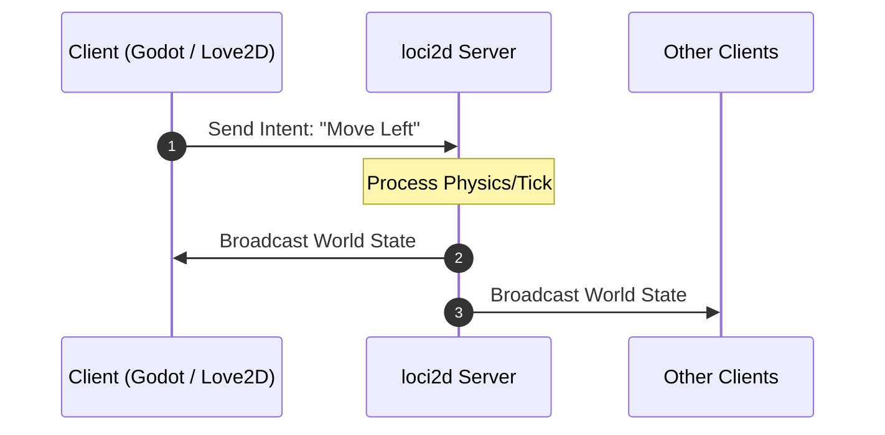

# loci2d

**loci2d elimina a parte mais difícil de fazer um jogo multiplayer — a rede — pra você focar no jogo em si.**

### English
Ever shelved a co-op or PvP game idea because "the networking is too hard"? That's exactly the problem loci2d exists to solve. It's an authoritative, deterministic 2D multiplayer game server written in Rust that sits in front of any client engine — Godot, Love2D, Python, or your own C++/WASM client. Your engine handles rendering and feel; loci2d owns the simulation, synchronization, and fairness.

**Why loci2d?**
- **Bring your own engine.** loci2d speaks Protobuf over UDP, so it doesn't care whether your client is Godot, Love2D, Python, or something else — build the game feel in whatever tool you already know. *(Coming soon: Official SDKs/wrappers for Godot 4 and Love2D)*
- **You don't write netcode.** Clients send *intentions* ("move this way", "use ability 1"); the authoritative server handles all physics, collision, and state sync. No client-side prediction or reconciliation to debug.
- **Game rules live in a sandboxed Lua script, not in the server.** The Rust core stays generic — health, teams, abilities, and win conditions are defined by you in Lua, without touching Rust or recompiling the server.
- **Deterministic by design.** Every match runs on fixed-point math, so the exact same match replays bit-for-bit on a different machine — enabling live spectating, verifiable replays, and tournament-grade trust in results.

**Who is this for?**
- Students building their first multiplayer game without learning networking first
- Game jam teams where each person wants to work in the engine they're fastest in
- Indie devs prototyping a multiplayer idea without months of infrastructure work

loci2d is engine-agnostic and flexible for any session-based 2D game — brawlers, arenas, co-op prototypes, party games. It's currently in active development (v0.6.x), heading toward its first real-world validation with student teams.

### Português
Já engavetou uma ideia de jogo cooperativo ou PvP porque "a parte de rede é complicada demais"? É exatamente esse problema que o loci2d resolve. Ele é um servidor de jogos 2D multiplayer autoritativo e determinístico, escrito em Rust, que você conecta com qualquer engine cliente — Godot, Love2D, Python, ou seu próprio cliente em C++/WASM. Sua engine cuida da renderização e da movimentação do jogo; o loci2d cuida da simulação, da sincronização e das regras da partida.

**Por que o loci2d?**
- **Use a engine que quiser.** O loci2d fala Protobuf sobre UDP, então não importa se seu cliente é Godot, Love2D, Python ou qualquer outra coisa — construa a experiência do jogo na ferramenta que você já domina. *(Em breve: SDKs e templates oficiais para Godot 4 e Love2D)*
- **Você não escreve netcode.** Os clientes enviam *intenções* (ex: "mover nessa direção", "usar habilidade 1"); o servidor autoritativo cuida de toda a física, colisão e sincronização de estado. Nenhum cliente precisa prever ou reconciliar nada.
- **As regras do jogo vivem num script Lua sandboxed, não no servidor.** O núcleo em Rust permanece genérico — vida, times, habilidades e condições de vitória são definidas por você em Lua, sem tocar em Rust nem recompilar o servidor.
- **Determinístico por design.** Toda partida roda em matemática de ponto fixo, então a mesma partida pode ser reproduzida byte a byte em outra máquina — habilitando espectadores ao vivo, replays verificáveis e confiança de nível competitivo nos resultados.

**Pra quem é esse projeto?**
- Estudantes construindo seu primeiro jogo multiplayer sem precisar aprender rede antes
- Equipes de game jam onde cada pessoa quer trabalhar na engine em que é mais rápida
- Devs indie prototipando uma ideia multiplayer sem meses de trabalho de infraestrutura

O loci2d é agnóstico em relação à engine e flexível pra qualquer jogo 2D baseado em partidas — brawlers, arenas, protótipos cooperativos, party games. Está atualmente em desenvolvimento ativo (v0.6.x), a caminho da primeira validação real com equipes de estudantes.

---

## How It Works / Como Funciona



### English
1. **Client Sends Intent**: The client game engine (Godot, Love2D, etc.) does not modify game state directly. It sends an intent (e.g., *"Move direction X, Y"* or *"Cast ability 1"*).
2. **Server Processes Tick**: `loci2d` runs the authoritative game loop for that instance, validates physics/collisions, and updates entity states.
3. **Server Syncs State**: `loci2d` broadcasts the authoritative world state back to all connected clients for rendering.

### Português
1. **Cliente Envia Intenção**: A engine do cliente (Godot, Love2D, etc.) não altera o estado do jogo diretamente. Ela envia uma intenção (ex: *"Mover na direção X, Y"* ou *"Usar habilidade 1"*).
2. **Servidor Processa o Tick**: O `loci2d` executa o game loop autoritativo daquela instância, valida a física/colisões e atualiza os estados das entidades.
3. **Servidor Sincroniza o Estado**: O `loci2d` envia o estado oficial do mundo de volta para todos os clientes renderizarem na tela.

---

## Architecture & Serialization / Arquitetura & Serialização

### English
- **Protocol Definition (`proto/game_packets.proto`)**: Authoritative `.proto` schema defining envelopes (`GamePacket`, `ServerPacket`), outbound snapshots (`WorldState`, `EntityState`), responses (`ServerResponse`), and extensible client intents (`MoveIntent`, `MoveToPositionIntent`, `ActionIntent`, `PingIntent`, `JoinIntent`, `DisconnectIntent`).
- **Rust Code Generation**: Handled automatically at build time via `build.rs`, `prost-build`, and `protoc-bin-vendored` (no manual `protoc` installation required).
- **Architectural Decision Records**: See [ADR 0005: Cross-Language Binary Serialization](docs/adr/0005-cross-language-binary-serialization.md) and [ADR 0006: Two-Thread Network/Game-Loop Separation](docs/adr/0006-two-thread-network-gameloop-separation.md) for full design rationale.
- **Project Roadmap**: See [docs/roadmap.md](docs/roadmap.md) for planned milestones and development stages.

### Português
- **Definição de Protocolo (`proto/game_packets.proto`)**: Esquema `.proto` autoritativo definindo envelopes (`GamePacket`, `ServerPacket`), snapshots de saída (`WorldState`, `EntityState`), respostas (`ServerResponse`) e intenções extensíveis de cliente (`MoveIntent`, `MoveToPositionIntent`, `ActionIntent`, `PingIntent`, `JoinIntent`, `DisconnectIntent`).
- **Geração de Código Rust**: Executada automaticamente no tempo de compilação via `build.rs`, `prost-build` e `protoc-bin-vendored` (sem necessidade de instalação manual do `protoc`).
- **Registros de Decisão de Arquitetura (ADRs)**: Veja a [ADR 0005: Serialização Binária Multi-linguagem](docs/adr/0005-cross-language-binary-serialization.md) e [ADR 0006: Separação Rede/Game-Loop](docs/adr/0006-two-thread-network-gameloop-separation.md) para a justificativa do design.
- **Roadmap do Projeto**: Veja [docs/roadmap.md](docs/roadmap.md) para os marcos planejados e etapas de desenvolvimento.

---

## Multi-Language Client Examples / Exemplos de Clientes em Várias Linguagens

### English
Cross-language client integration examples are available in the [`examples/`](examples/) directory:

- **[Python Example](examples/python/README.md)**: Python UDP client using standard `protobuf` decoding real-time `WorldState` snapshots.
- **[Love2D Example](examples/love2d/README.md)**: Love2D Lua client using `lua-protobuf` rendering 2D multi-entity movement in real time.
- **[Godot Example](examples/godot/README.md)**: Godot 4 GDScript example using `PacketPeerUDP` and GDScript Protobuf for spatial synchronization.

### Português
Exemplos de integração de clientes em diferentes linguagens estão disponíveis no diretório [`examples/`](examples/):

- **[Exemplo em Python](examples/python/README.md)**: Cliente UDP em Python utilizando a biblioteca padrão `protobuf` decodificando snapshots de `WorldState` em tempo real.
- **[Exemplo em Love2D](examples/love2d/README.md)**: Cliente em Lua para Love2D utilizando `lua-protobuf` renderizando movimentação 2D de múltiplas entidades em tempo real.
- **[Exemplo em Godot](examples/godot/README.md)**: Exemplo em GDScript para Godot 4 utilizando `PacketPeerUDP` e GDScript Protobuf para sincronização espacial.

---

## Quickstart & Testing / Início Rápido e Testes (Rust Server & CLI Client)

### 1. Start the Server / Iniciar o Servidor
```bash
cargo run
```
* **EN**: The server binds to `127.0.0.1:8080` over UDP and deserializes Protobuf `GamePacket` messages.
* **PT**: O servidor vincula-se ao endereço `127.0.0.1:8080` via UDP e desserializa mensagens `GamePacket` do Protobuf.

### 2. Start the Rust CLI Client / Iniciar o Cliente CLI em Rust
In a second terminal / Em um segundo terminal:
```bash
cargo run --bin client
```

### 3. Client Commands / Comandos do Cliente
- `join <name>` — Send join handshake with player name (e.g., `join Alice`) / Envia handshake de entrada com nome do jogador (ex: `join Alice`)
- `status` — Inspect latest world state snapshot and active entities / Inspeciona o snapshot mais recente do estado do mundo e entidades ativas
- `move <x> <y>` — Send 2D movement intent (e.g., `move 1.0 0.5`) / Envia intenção de movimento 2D (ex: `move 1.0 0.5`)
- `stream <on|off>` — Toggle live background snapshot logging (default: off) / Alterna o log contínuo de snapshots em segundo plano (padrão: desativado)
- `leave [reason]` — Send disconnect intent (e.g., `leave quitting`) / Envia intenção de desconexão (ex: `leave quitting`)
- `action <id>` — Send action intent with ability ID (e.g., `action 42`) / Envia intenção de ação com ID de habilidade (ex: `action 42`)
- `ping` — Send ping intent / Envia intenção de ping
- `quit` — Gracefully disconnect and exit client / Desconecta graciosamente e sai do cliente

### Example Session / Sessão de Exemplo
```
Enter command: join Alice
[2026-08-08 17:30:00] Sent 16 bytes to server: sequence_id=0

Enter command: status
--- [World State Snapshot | Tick 30 | Timestamp: 1723140000000] ---
  Active Entities (1):
    - Entity 1 ("Alice", Player) @ (0.0, 0.0), vel=(0.0, 0.0)
---------------------------------------------------------

Enter command: move 1.0 0.5
[2026-08-08 17:30:05] Sent 22 bytes to server: sequence_id=1

Enter command: status
--- [World State Snapshot | Tick 150 | Timestamp: 1723140005000] ---
  Active Entities (1):
    - Entity 1 ("Alice", Player) @ (4.0, 2.0), vel=(1.0, 0.5)
---------------------------------------------------------

Enter command: quit
[2026-08-08 17:30:10] Sending disconnect and shutting down...
[2026-08-08 17:30:10] Sent 22 bytes to server: sequence_id=2
```

---

## Deterministic Replay & Spectator System / Sistema de Replay Determinístico & Espectador

### English
`loci2d` includes an event-sourced deterministic match recording, verification, and live spectator broadcast engine:

```bash
# 1. Start Server with Live Match Recording
cargo run --bin loci2d -- --record match_01.loci

# 2. Custom Checkpoint Frequency (e.g. every 120 ticks)
cargo run --bin loci2d -- --record match_01.loci --checkpoint-interval 120

# 3. Headless Determinism Verification (CI-Ready, max CPU speed)
cargo run --bin loci2d -- --replay match_01.loci --verify

# 4. Live Spectator Broadcast Server (Broadcasts to Godot, Love2D, Python, CLI)
cargo run --bin loci2d -- --replay match_01.loci --broadcast 127.0.0.1:8080 --speed 1.0

# 5. Fast-Forward Replay Broadcast (2x or 4x speed)
cargo run --bin loci2d -- --replay match_01.loci --broadcast 127.0.0.1:8080 --speed 2.0
```

### Português
O `loci2d` inclui um motor de gravação de partidas baseado em event sourcing, verificação determinística e transmissão para espectadores ao vivo:

```bash
# 1. Iniciar Servidor com Gravação de Partida
cargo run --bin loci2d -- --record match_01.loci

# 2. Frequência Personalizada de Checkpoints (ex: a cada 120 ticks)
cargo run --bin loci2d -- --record match_01.loci --checkpoint-interval 120

# 3. Verificação Determinística Headless (Ideal para CI, velocidade máxima)
cargo run --bin loci2d -- --replay match_01.loci --verify

# 4. Servidor de Transmissão para Espectadores (Transmite para Godot, Love2D, Python, CLI)
cargo run --bin loci2d -- --replay match_01.loci --broadcast 127.0.0.1:8080 --speed 1.0

# 5. Transmissão Acelerada de Replay (velocidade 2x ou 4x)
cargo run --bin loci2d -- --replay match_01.loci --broadcast 127.0.0.1:8080 --speed 2.0
```

