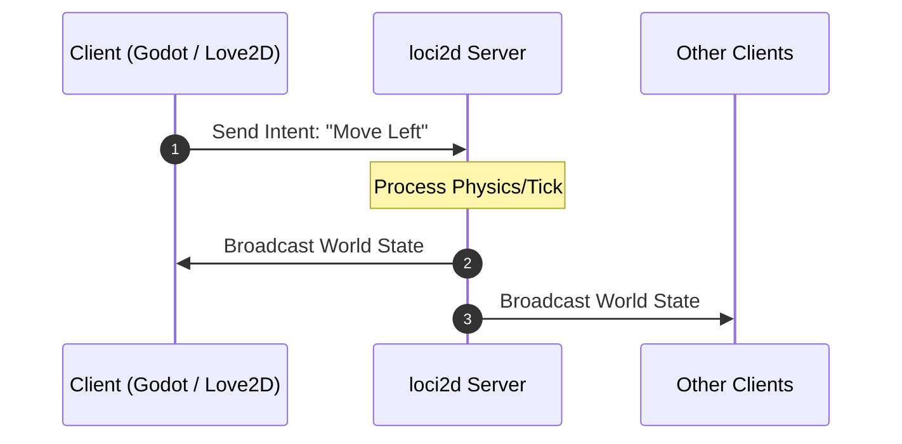

# loci2d

> **loci2d takes the hardest part of making a multiplayer game — networking — off your plate so you can focus on building the game itself.**
>
> 🌐 *Read this in [Português (Brasil)](README.pt-BR.md)*

Ever shelved a co-op or PvP game idea because "the networking is too hard"? That's exactly the problem loci2d exists to solve. It's an authoritative, deterministic 2D multiplayer game server written in Rust that sits in front of any client engine — Godot, Love2D, Python, or your own C++/WASM client. Your engine handles rendering and feel; loci2d owns the simulation, synchronization, and fairness.

**Why loci2d?**
- **Bring your own engine.** loci2d speaks Protobuf over UDP, so it doesn't care whether your client is Godot, Love2D, Python, or something else — build the game feel in whatever tool you already know. *(Coming soon: Official SDKs/wrappers for Godot 4 and Love2D)*
- **You don't write netcode.** Clients send *intentions* ("move this way", "use ability 1"); the authoritative server handles all physics, collision, and state sync. No client-side prediction or reconciliation to debug.
- **Game rules live in a sandboxed Lua script, not in the server.** The Rust core stays generic — health, teams, abilities, and win conditions are defined by you in Lua, without touching Rust or recompiling the server.
- **Deterministic by design.** Every match runs on fixed-point math, so the exact same match replays bit-for-bit on a different machine — enabling live spectating, verifiable replays, and tournament-grade trust in results.

**Who is this for?**
- Students building their first multiplayer game without learning networking first
- Game jam teams where each person wants to work in the engine they're fastest in
- Indie devs prototyping a multiplayer idea without months of infrastructure work

loci2d is engine-agnostic and flexible for any session-based 2D game — brawlers, arenas, co-op prototypes, party games. It's currently in active development (v0.6.x), heading toward its first real-world validation with student teams.

---

## How It Works



1. **Client Sends Intent**: The client game engine (Godot, Love2D, etc.) does not modify game state directly. It sends an intent (e.g., *"Move direction X, Y"* or *"Cast ability 1"*).
2. **Server Processes Tick**: `loci2d` runs the authoritative game loop for that instance, validates physics/collisions, and updates entity states.
3. **Server Syncs State**: `loci2d` broadcasts the authoritative world state back to all connected clients for rendering.

---

## Architecture & Serialization

- **Protocol Definition (`proto/game_packets.proto`)**: Authoritative `.proto` schema defining envelopes (`GamePacket`, `ServerPacket`), outbound snapshots (`WorldState`, `EntityState`), responses (`ServerResponse`), and extensible client intents (`MoveIntent`, `MoveToPositionIntent`, `ActionIntent`, `PingIntent`, `JoinIntent`, `DisconnectIntent`).
- **Rust Code Generation**: Handled automatically at build time via `build.rs`, `prost-build`, and `protoc-bin-vendored` (no manual `protoc` installation required).
- **Architectural Decision Records**: See [ADR 0005: Cross-Language Binary Serialization](docs/adr/en/0005-cross-language-binary-serialization.md) and [ADR 0006: Two-Thread Network/Game-Loop Separation](docs/adr/en/0006-two-thread-network-gameloop-separation.md) for full design rationale.
- **Project Roadmap**: See [docs/roadmap.md](docs/roadmap.md) for planned milestones and development stages.

---

## 🛠️ Prerequisites & Installation

When setting up the project on a **new machine**, ensure the following tools are installed:

### 1. Required Tools
- **C Compiler & Build Tools**: Required to compile C dependencies (e.g., Lua 5.4 via `mlua`).
- **Rust (Cargo)**: Version **1.85+** (loci2d uses the Rust 2024 edition).
- **LÖVE (Love2D)**: Required to run the primary client example (`examples/love2d`).

### 2. OS-Specific Installation Commands

#### 🐧 Linux (Ubuntu / Debian / Pop!_OS)
```bash
# 1. Install C compiler, pkg-config, and Love2D
sudo apt update
sudo apt install -y build-essential pkg-config love

# 2. Install Rust via rustup (if not already installed)
curl --proto '=https' --tlsv1.2 -sSf https://sh.rustup.rs | sh
source "$HOME/.cargo/env"

# 3. Ensure Rust is up to date
rustup update stable
```

#### 🐧 Linux (Arch Linux / Manjaro)
```bash
sudo pacman -S base-devel pkgconf love rustup
rustup default stable
```

#### 🐧 Linux (Fedora / RHEL)
```bash
sudo dnf install -y gcc gcc-c++ make pkg-config love
curl --proto '=https' --tlsv1.2 -sSf https://sh.rustup.rs | sh
source "$HOME/.cargo/env"
```

#### 🍏 macOS
```bash
# 1. Apple build tools
xcode-select --install

# 2. Install Love2D via Homebrew
brew install --cask love

# 3. Install Rust via rustup
curl --proto '=https' --tlsv1.2 -sSf https://sh.rustup.rs | sh
source "$HOME/.cargo/env"
```

#### 🪟 Windows
1. **Rust**: Download and run the installer from [rustup.rs](https://rustup.rs/) (select Visual Studio C++ Build Tools during setup).
2. **Love2D**: Download the installer from [love2d.org](https://love2d.org/) or install via terminal: `winget install LOVE.LOVE`. Ensure the `love` executable is in your PATH.

---

### 🔍 Quick Environment Check
Run the verification script to check if your machine has all required dependencies:
```bash
./tools/setup_environment.sh
```

---

## 🚀 How to Run the Project

The primary development workflow runs the **Rust server** alongside the **Love2D client**:

### Method 1: Step-by-Step (2 Terminals)

#### Terminal 1 — Start the Server
```bash
cargo run
```
*The server binds to UDP port `127.0.0.1:8080`.*

#### Terminal 2 — Start the Love2D Client
```bash
love examples/love2d
```
*The Love2D client will launch and connect to the local server.*

---

### Method 2: Single Command Script (Linux/macOS)
To launch both the server and the Love2D client together:
```bash
./tools/run_dev.sh
```

---

## Multi-Language Client Examples

Cross-language client integration examples are available in the [`examples/`](examples/) directory:

- **[Love2D Example (Primary)](examples/love2d/README.md)**: Love2D Lua client using `lua-protobuf` rendering 2D multi-entity movement and spectator mode in real time.
- **[Python Example](examples/python/README.md)**: Python UDP client using standard `protobuf` decoding real-time `WorldState` snapshots.
- **[Godot Example](examples/godot/README.md)**: Godot 4 GDScript example using `PacketPeerUDP` and GDScript Protobuf for spatial synchronization.

---

## Quickstart with Rust CLI Client

If you want to test via the command line without launching the graphical client:

### 1. Start the Server
```bash
cargo run
```
The server binds to `127.0.0.1:8080` over UDP and deserializes Protobuf `GamePacket` messages.

### 2. Start the Rust CLI Client
In a second terminal:
```bash
cargo run --bin client
```

### 3. Client Commands
- `join <name>` — Send join handshake with player name (e.g., `join Alice`)
- `status` — Inspect latest world state snapshot and active entities
- `move <x> <y>` — Send 2D movement intent (e.g., `move 1.0 0.5`)
- `stream <on|off>` — Toggle live background snapshot logging (default: off)
- `leave [reason]` — Send disconnect intent (e.g., `leave quitting`)
- `action <id>` — Send action intent with ability ID (e.g., `action 42`)
- `ping` — Send ping intent
- `quit` — Gracefully disconnect and exit client

### Example Session
```
Enter command: join Alice
[2026-08-08 17:30:00] Sent 16 bytes to server: sequence_id=0

Enter command: status
--- [World State Snapshot | Tick 30 | Timestamp: 1723140000000] ---
  Active Entities (1):
    - Entity 1 ("Alice", Player) @ (0.0, 0.0), vel=(0.0, 0.0)
---------------------------------------------------------

Enter command: move 1.0 0.5
[2026-08-08 17:30:05] Sent 22 bytes to server: sequence_id=1

Enter command: status
--- [World State Snapshot | Tick 150 | Timestamp: 1723140005000] ---
  Active Entities (1):
    - Entity 1 ("Alice", Player) @ (4.0, 2.0), vel=(1.0, 0.5)
---------------------------------------------------------

Enter command: quit
[2026-08-08 17:30:10] Sending disconnect and shutting down...
[2026-08-08 17:30:10] Sent 22 bytes to server: sequence_id=2
```

---

## Deterministic Replay & Spectator System

`loci2d` includes an event-sourced deterministic match recording, verification, and live spectator broadcast engine:

```bash
# 1. Start Server with Live Match Recording
cargo run --bin loci2d -- --record match_01.loci

# 2. Custom Checkpoint Frequency (e.g. every 120 ticks)
cargo run --bin loci2d -- --record match_01.loci --checkpoint-interval 120

# 3. Headless Determinism Verification (CI-Ready, max CPU speed)
cargo run --bin loci2d -- --replay match_01.loci --verify

# 4. Live Spectator Broadcast Server (Broadcasts to Godot, Love2D, Python, CLI)
cargo run --bin loci2d -- --replay match_01.loci --broadcast 127.0.0.1:8080 --speed 1.0

# 5. Fast-Forward Replay Broadcast (2x or 4x speed)
cargo run --bin loci2d -- --replay match_01.loci --broadcast 127.0.0.1:8080 --speed 2.0
```
