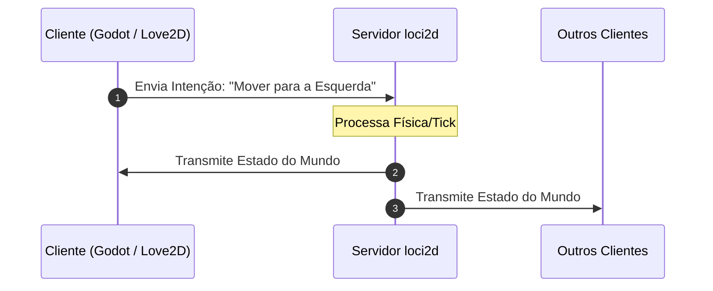

# loci2d

> **loci2d elimina a parte mais difícil de fazer um jogo multiplayer — a rede — pra você focar no jogo em si.**
>
> 🌐 *Read this in [English](README.md)*

Já engavetou uma ideia de jogo cooperativo ou PvP porque "a parte de rede é complicada demais"? É exatamente esse problema que o loci2d resolve. Ele é um servidor de jogos 2D multiplayer autoritativo e determinístico, escrito em Rust, que você conecta com qualquer engine cliente — Godot, Love2D, Python, ou seu próprio cliente em C++/WASM. Sua engine cuida da renderização e da movimentação do jogo; o loci2d cuida da simulação, da sincronização e das regras da partida.

**Por que o loci2d?**
- **Use a engine que quiser.** O loci2d fala Protobuf sobre UDP, então não importa se seu cliente é Godot, Love2D, Python ou qualquer outra coisa — construa a experiência do jogo na ferramenta que você já domina. *(Em breve: SDKs e templates oficiais para Godot 4 e Love2D)*
- **Você não escreve netcode.** Os clientes enviam *intenções* (ex: "mover nessa direção", "usar habilidade 1"); o servidor autoritativo cuida de toda a física, colisão e sincronização de estado. Nenhum cliente precisa prever ou reconciliar nada.
- **As regras do jogo vivem num script Lua sandboxed, não no servidor.** O núcleo em Rust permanece genérico — vida, times, habilidades e condições de vitória são definidas por você em Lua, sem tocar em Rust nem recompilar o servidor.
- **Determinístico por design.** Toda partida roda em matemática de ponto fixo, então a mesma partida pode ser reproduzida byte a byte em outra máquina — habilitando espectadores ao vivo, replays verificáveis e confiança de nível competitivo nos resultados.

**Pra quem é esse projeto?**
- Estudantes construindo seu primeiro jogo multiplayer sem precisar aprender rede antes
- Equipes de game jam onde cada pessoa quer trabalhar na engine em que é mais rápida
- Devs indie prototipando uma ideia multiplayer sem meses de trabalho de infraestrutura

O loci2d é agnóstico em relação à engine e flexível pra qualquer jogo 2D baseado em partidas — brawlers, arenas, protótipos cooperativos, party games. Está atualmente em desenvolvimento ativo (v0.6.x), a caminho da primeira validação real com equipes de estudantes.

---

## Como Funciona



1. **Cliente Envia Intenção**: A engine do cliente (Godot, Love2D, etc.) não altera o estado do jogo diretamente. Ela envia uma intenção (ex: *"Mover na direção X, Y"* ou *"Usar habilidade 1"*).
2. **Servidor Processa o Tick**: O `loci2d` executa o game loop autoritativo daquela instância, valida a física/colisões e atualiza os estados das entidades.
3. **Servidor Sincroniza o Estado**: O `loci2d` envia o estado oficial do mundo de volta para todos os clientes renderizarem na tela.

---

## Arquitetura & Serialização

- **Definição de Protocolo (`proto/game_packets.proto`)**: Esquema `.proto` autoritativo definindo envelopes (`GamePacket`, `ServerPacket`), snapshots de saída (`WorldState`, `EntityState`), respostas (`ServerResponse`) e intenções extensíveis de cliente (`MoveIntent`, `MoveToPositionIntent`, `ActionIntent`, `PingIntent`, `JoinIntent`, `DisconnectIntent`).
- **Geração de Código Rust**: Executada automaticamente no tempo de compilação via `build.rs`, `prost-build` e `protoc-bin-vendored` (sem necessidade de instalação manual do `protoc`).
- **Registros de Decisão de Arquitetura (ADRs)**: Veja a [ADR 0005: Serialização Binária Multilinguagem](docs/adr/pt/0005-serializacao-binaria-multilinguagem.md) e [ADR 0006: Separação Duas Threads Rede/GameLoop](docs/adr/pt/0006-separacao-duas-threads-rede-gameloop.md) para a justificativa do design.
- **Roadmap do Projeto**: Veja [docs/roadmap.pt-BR.md](docs/roadmap.pt-BR.md) para os marcos planejados e etapas de desenvolvimento.

---

## 🛠️ Pré-requisitos e Instalação

Ao clonar o projeto em uma **máquina nova**, certifique-se de ter os pré-requisitos instalados:

### 1. Ferramentas Necessárias
- **Compilador C / Ferramentas de Build**: Necessário para compilar as dependências de C (ex: Lua 5.4 pelo `mlua`).
- **Rust (Cargo)**: Versão **1.85+** (o projeto utiliza a edição Rust 2024).
- **LÖVE (Love2D)**: Necessário para rodar o cliente gráfico de exemplo (`examples/love2d`).

### 2. Comandos de Instalação por Sistema Operacional

#### 🐧 Linux (Ubuntu / Debian / Pop!_OS)
```bash
# 1. Instalar compilador C, pkg-config e Love2D
sudo apt update
sudo apt install -y build-essential pkg-config love

# 2. Instalar Rust via rustup (caso não tenha instalado)
curl --proto '=https' --tlsv1.2 -sSf https://sh.rustup.rs | sh
source "$HOME/.cargo/env"

# 3. Garantir Rust atualizado
rustup update stable
```

#### 🐧 Linux (Arch Linux / Manjaro)
```bash
sudo pacman -S base-devel pkgconf love rustup
rustup default stable
```

#### 🐧 Linux (Fedora / RHEL)
```bash
sudo dnf install -y gcc gcc-c++ make pkg-config love
curl --proto '=https' --tlsv1.2 -sSf https://sh.rustup.rs | sh
source "$HOME/.cargo/env"
```

#### 🍏 macOS
```bash
# 1. Ferramentas de compilação da Apple
xcode-select --install

# 2. Instalar Love2D via Homebrew
brew install --cask love

# 3. Instalar Rust via rustup
curl --proto '=https' --tlsv1.2 -sSf https://sh.rustup.rs | sh
source "$HOME/.cargo/env"
```

#### 🪟 Windows
1. **Rust**: Baixe e execute o instalador em [rustup.rs](https://rustup.rs/) (selecione C++ Build Tools do Visual Studio durante a instalação).
2. **Love2D**: Baixe o instalador em [love2d.org](https://love2d.org/) ou instale via terminal: `winget install LOVE.LOVE`. Certifique-se de que o executável `love` está no seu PATH.

---

### 🔍 Verificação Rápida do Ambiente
Você pode rodar o script utilitário para checar se todas as dependências estão prontas:
```bash
./tools/setup_environment.sh
```

---

## 🚀 Como Rodar o Projeto

O fluxo padrão de desenvolvimento consiste em rodar o **servidor Rust** e o **cliente Love2D**:

### Método 1: Passo a Passo (2 Terminais)

#### Terminal 1 — Iniciar o Servidor
```bash
cargo run
```
*O servidor iniciará e escutará conexões UDP na porta `127.0.0.1:8080`.*

#### Terminal 2 — Iniciar o Cliente Love2D
```bash
love examples/love2d
```
*A janela do Love2D abrirá conectando-se automaticamente ao servidor local.*

---

### Método 2: Script Único (Linux/macOS)
Para iniciar o servidor e abrir o cliente Love2D automaticamente com um único comando:
```bash
./tools/run_dev.sh
```

---

## Exemplos de Clientes em Várias Linguagens

Exemplos de integração de clientes em diferentes linguagens estão disponíveis no diretório [`examples/`](examples/):

- **[Exemplo em Love2D (Principal)](examples/love2d/README.md)**: Cliente em Lua para Love2D utilizando `lua-protobuf` renderizando movimentação 2D, estados e modo espectador em tempo real.
- **[Exemplo em Python](examples/python/README.md)**: Cliente UDP em Python utilizando a biblioteca padrão `protobuf` decodificando snapshots de `WorldState` em tempo real.
- **[Exemplo em Godot](examples/godot/README.md)**: Exemplo em GDScript para Godot 4 utilizando `PacketPeerUDP` e GDScript Protobuf para sincronização espacial.

---

## Início Rápido com Cliente CLI em Rust

Caso queira testar via linha de comando sem abrir o cliente gráfico:

### 1. Iniciar o Servidor
```bash
cargo run
```
O servidor vincula-se ao endereço `127.0.0.1:8080` via UDP e desserializa mensagens `GamePacket` do Protobuf.

### 2. Iniciar o Cliente CLI em Rust
Em um segundo terminal:
```bash
cargo run --bin client
```

### 3. Comandos do Cliente
- `join <nome>` — Envia handshake de entrada com nome do jogador (ex: `join Alice`)
- `status` — Inspeciona o snapshot mais recente do estado do mundo e entidades ativas
- `move <x> <y>` — Envia intenção de movimento 2D (ex: `move 1.0 0.5`)
- `stream <on|off>` — Alterna o log contínuo de snapshots em segundo plano (padrão: desativado)
- `leave [motivo]` — Envia intenção de desconexão (ex: `leave quitting`)
- `action <id>` — Envia intenção de ação com ID de habilidade (ex: `action 42`)
- `ping` — Envia intenção de ping
- `quit` — Desconecta graciosamente e sai do cliente

### Sessão de Exemplo
```
Enter command: join Alice
[2026-08-08 17:30:00] Sent 16 bytes to server: sequence_id=0

Enter command: status
--- [World State Snapshot | Tick 30 | Timestamp: 1723140000000] ---
  Active Entities (1):
    - Entity 1 ("Alice", Player) @ (0.0, 0.0), vel=(0.0, 0.0)
---------------------------------------------------------

Enter command: move 1.0 0.5
[2026-08-08 17:30:05] Sent 22 bytes to server: sequence_id=1

Enter command: status
--- [World State Snapshot | Tick 150 | Timestamp: 1723140005000] ---
  Active Entities (1):
    - Entity 1 ("Alice", Player) @ (4.0, 2.0), vel=(1.0, 0.5)
---------------------------------------------------------

Enter command: quit
[2026-08-08 17:30:10] Sending disconnect and shutting down...
[2026-08-08 17:30:10] Sent 22 bytes to server: sequence_id=2
```

---

## Sistema de Replay Determinístico & Espectador

O `loci2d` inclui um motor de gravação de partidas baseado em event sourcing, verificação determinística e transmissão para espectadores ao vivo:

```bash
# 1. Iniciar Servidor com Gravação de Partida
cargo run --bin loci2d -- --record match_01.loci

# 2. Frequência Personalizada de Checkpoints (ex: a cada 120 ticks)
cargo run --bin loci2d -- --record match_01.loci --checkpoint-interval 120

# 3. Verificação Determinística Headless (Ideal para CI, velocidade máxima)
cargo run --bin loci2d -- --replay match_01.loci --verify

# 4. Servidor de Transmissão para Espectadores (Transmite para Godot, Love2D, Python, CLI)
cargo run --bin loci2d -- --replay match_01.loci --broadcast 127.0.0.1:8080 --speed 1.0

# 5. Transmissão Acelerada de Replay (velocidade 2x ou 4x)
cargo run --bin loci2d -- --replay match_01.loci --broadcast 127.0.0.1:8080 --speed 2.0
```
