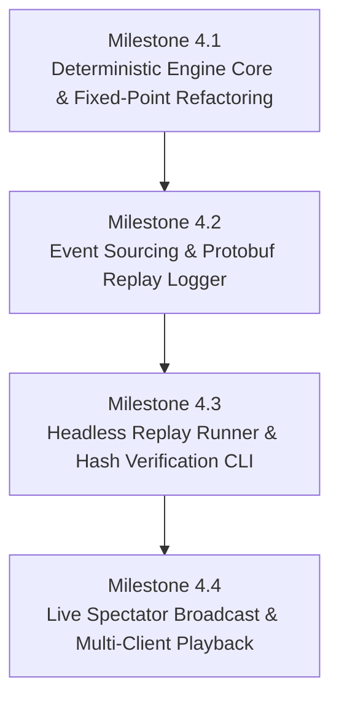

# Implementation Spec — Phase 4: Deterministic Simulation & Replay Engine

> **Status:** Ready to Implement  
> **Roadmap Phase:** Phase 4 — Event Logging & Deterministic Replay System  
> **Reference ADRs:** [ADR-0001](../adr/en/0001-authoritative-server-archoitecture.md) · [ADR-0002](../adr/en/0002-instance-based-architecture.md) · [ADR-0003](../adr/en/0003-2d-map-only.md) · [ADR-0005](../adr/en/0005-cross-language-binary-serialization.md) · [ADR-0006](../adr/en/0006-two-thread-network-gameloop-separation.md) · [ADR-0007](../adr/en/0007-deterministic-simulation-and-fixed-point.md) · [ADR-0008](../adr/en/0008-session-lifecycle-and-client-identity.md) · [ADR-0009](../adr/en/0009-simplified-authentication-and-auto-join-strategy.md)

---

## 1. Context & Technical Motivation

In **Phases 1–3**, `loci2d` established an authoritative, single-instance 2D game server capable of receiving client intents over UDP and broadcasting serialized `WorldState` snapshots back to multi-language clients (Godot, Love2D, Python, Rust CLI).

During those initial validation phases, the server operated with standard IEEE 754 floating-point operations (`f32`), randomized hash maps (`HashMap`), and OS-dependent `thread::sleep` timing. While optimal for rapid prototyping, these components exhibit **four fundamental non-deterministic flaws** that prevent bit-exact match replays across different operating systems, CPU architectures, and runtime environments:

| Area | MVP Implementation (Phases 1–3) | Non-Deterministic Flaw | Target Deterministic Solution (Phase 4) |
|---|---|---|---|
| **1. Tick Timing** | `thread::sleep(budget - elapsed)` | Windows default timer interrupt (~15.6 ms) vs Linux (~1 ms) causes tick stutter, drift, and jitter | **Fixed-Timestep Accumulator** with sub-millisecond precision and overshoot protection |
| **2. Data Collection** | `HashMap<u64, Entity>` | `SipHash` random seed per process causes non-deterministic entity iteration order across runs | **`BTreeMap<u64, Entity>`** guaranteeing strictly ordered key traversal (`1, 2, 3...`) |
| **3. Arithmetic** | IEEE 754 `f32` floats | Fused Multiply-Add (FMA), SIMD differences (x86 AVX/SSE vs ARM64 NEON), and compiler optimization reordering produce divergent float roundings | **Fixed-Point Math (`I16F16`)** with pure integer ALU arithmetic for all simulation calculations |
| **4. Input Scheduling** | Network thread `recv_from` $\rightarrow$ immediate `try_recv` | Packet arrival timing jitter across network/OS causes intents to execute on non-deterministic ticks | **Tick-Indexed Event Sourcing** logging intents stamped by tick and `entity_id` inside the Game Loop |

```
┌──────────────────────────────────────────────────────────────────────────────────────────────────┐
│ Non-Deterministic vs Deterministic Simulation Pipeline                                           │
│                                                                                                  │
│ [Phases 1-3: Non-Deterministic]                                                                  │
│ Live UDP Packets ──► try_recv() ──► f32 Physics Update ──► Non-Identical State on ARM vs x86     │
│                                                                                                  │
│ [Phase 4: Deterministic Event-Sourced Pipeline]                                                  │
│ Live UDP Packets ──► Intent Queue                                                                │
│                           │                                                                      │
│                           ▼ (Sealed at Tick Boundary)                                            │
│                     ┌───────────┐                                                                │
│                     │ Tick N    │ ──► Recorded to .loci Replay File (Protobuf)                   │
│                     └─────┬─────┘                                                                │
│                           ▼                                                                      │
│              Fixed-Point Math (I16F16) & BTreeMap                                                │
│                           │                                                                      │
│                           ▼                                                                      │
│              Canonical State SHA-256 Hash (100% Bit-Exact on Linux, macOS ARM64, Windows)        │
└──────────────────────────────────────────────────────────────────────────────────────────────────┘
```

**Core Goal of Phase 4:** Achieve **100% bit-exact cross-platform determinism**, enabling any recorded match (`.loci` replay file) to be replayed frame-by-frame on any CPU architecture (x86_64, ARM64, WASM) and OS (Linux, Windows, macOS), generating identical `WorldState` SHA-256 checksums and streaming authoritative replays to any spectator client (Love2D, Godot, Python, CLI) with zero client code modifications.

---

## 2. Architecture & 4 Sequential Milestones

To manage the migration cleanly and ensure systematic verifiability, Phase 4 is structured into **4 sequential milestones**:



---

### Milestone 4.1: Deterministic Engine Core & Fixed-Point Refactoring

#### 1. Fixed-Point Mathematics (`I16F16`)
Floating-point math is replaced in the simulation domain by fixed-point numbers via the `fixed` crate (`fixed = "1.28"`).
- We use `fixed::types::I16F16` (16 bits integer part: range -32,768 to +32,767; 16 bits fractional part: precision $\approx 0.000015$ units / 65,536 sub-steps per unit).
- Pure integer arithmetic operations guarantee identical results across x86_64, ARM64 NEON, and WASM.

```rust
use fixed::types::I16F16;
use std::ops::{Add, AddAssign, Sub, SubAssign, Mul};

#[derive(Debug, Clone, Copy, PartialEq, Eq, PartialOrd, Ord, Hash, Default)]
pub struct DeterministicVector2 {
    pub x: I16F16,
    pub y: I16F16,
}

impl DeterministicVector2 {
    pub const ZERO: Self = Self {
        x: I16F16::ZERO,
        y: I16F16::ZERO,
    };

    pub fn new(x: I16F16, y: I16F16) -> Self {
        Self { x, y }
    }

    /// Quantizes an incoming float (e.g. from network MoveIntent) into fixed-point representation.
    pub fn from_f32(x: f32, y: f32) -> Self {
        Self {
            x: I16F16::from_num(x),
            y: I16F16::from_num(y),
        }
    }

    /// Converts fixed-point vector to float representation for Protobuf snapshots / client rendering.
    pub fn to_f32(self) -> (f32, f32) {
        (self.x.to_num::<f32>(), self.y.to_num::<f32>())
    }

    /// Calculates Manhattan distance using pure integer fixed-point math.
    pub fn manhattan_distance(self, other: Self) -> I16F16 {
        (self.x - other.x).abs() + (self.y - other.y).abs()
    }
}

impl Add for DeterministicVector2 {
    type Output = Self;
    fn add(self, rhs: Self) -> Self::Output {
        Self { x: self.x + rhs.x, y: self.y + rhs.y }
    }
}

impl AddAssign for DeterministicVector2 {
    fn add_assign(&mut self, rhs: Self) {
        self.x += rhs.x;
        self.y += rhs.y;
    }
}
```

#### 2. Network Boundary Quantization & Snapshot Conversion
- **Inbound boundary (`MoveIntent`)**: Incoming float direction `(f32, f32)` is quantized via `DeterministicVector2::from_f32(dir.x, dir.y)`.
- **Outbound boundary (`WorldState`)**: `Instance::create_snapshot()` converts `entity.position` and `entity.velocity` to Protobuf `Vector2 { x: f32, y: f32 }` using `pos.to_f32()`. This ensures external clients (Godot, Love2D, Python) continue receiving standard float vectors without requiring fixed-point decoders for rendering.

#### 3. Strict Ordered Collections (`BTreeMap`)
All entity and session storage in `Instance` is converted from `HashMap` to `BTreeMap`.
- Prevents `SipHash` random seed variance between processes and machines.
- Iteration during `tick()`, `check_timeouts()`, and `create_snapshot()` follows strict key order (`1, 2, 3...`).

```rust
use std::collections::BTreeMap;
use std::net::SocketAddr;

pub struct Instance {
    pub id: u64,
    pub entities: BTreeMap<u64, Entity>,
    pub sessions: BTreeMap<SocketAddr, ClientSession>,
    pub entity_to_addr: BTreeMap<u64, SocketAddr>,
    pub tick_rate: u32,
    pub client_timeout_secs: u64,
    next_entity_id: u64,
    next_session_id: u64,
}
```

#### 4. Sub-Millisecond Fixed-Timestep Accumulator Loop
Replace naive `thread::sleep(budget - elapsed)` with a fixed-timestep accumulator loop that prevents wall-clock drift, compensates for OS timer resolution differences, and clamps spiral-of-death situations.

```rust
pub struct GameLoop {
    tick_rate: u32,
    running: bool,
}

impl GameLoop {
    pub fn start(
        &mut self,
        mut instance: Instance,
        intent_rx: mpsc::Receiver<(SocketAddr, ClientIntent)>,
        socket: Arc<UdpSocket>,
    ) {
        self.running = true;
        let tick_duration = Duration::from_secs_f64(1.0 / self.tick_rate as f64);
        let max_accumulator = tick_duration * 5; // Spiral-of-death protection clamp
        let mut accumulator = Duration::ZERO;
        let mut last_time = Instant::now();
        let mut tick_count = 0u64;
        let mut out_buf = Vec::with_capacity(2048);

        while self.running {
            let now = Instant::now();
            let mut delta = now.duration_since(last_time);
            last_time = now;

            if delta > max_accumulator {
                delta = max_accumulator;
            }
            accumulator += delta;

            while accumulator >= tick_duration {
                // 1. Drain intents for this exact fixed tick
                while let Ok((addr, intent)) = intent_rx.try_recv() {
                    instance.apply_intent(addr, intent);
                }

                // 2. Advance deterministic simulation
                instance.tick(tick_count);

                // 3. Broadcast snapshot to active sessions
                let world_state = instance.create_snapshot(tick_count);
                let packet = ServerPacket {
                    sequence_id: tick_count,
                    payload: Some(server_packet::Payload::WorldState(world_state)),
                };
                out_buf.clear();
                if packet.encode(&mut out_buf).is_ok() {
                    for client_addr in instance.get_broadcast_addresses() {
                        let _ = socket.send_to(&out_buf, client_addr);
                    }
                }

                tick_count += 1;
                accumulator -= tick_duration;
            }

            // Yield / sleep briefly to prevent 100% CPU core spinning
            thread::sleep(Duration::from_micros(500));
        }
    }
}
```

---

### Milestone 4.2: Event Sourcing & Protobuf Replay Serialization

#### 1. Replay Schema (`proto/replay.proto`)
Formalize the replay format using Protocol Buffers v3 ([ADR-0005](../adr/en/0005-cross-language-binary-serialization.md)):

```protobuf
syntax = "proto3";

package loci2d;

import "game_packets.proto";

// Match recording metadata header
message ReplayHeader {
  string magic = 1;             // "LOCI_REPLAY"
  uint32 version = 2;           // Replay format version (e.g. 1)
  uint32 tick_rate = 3;         // Server tick rate (e.g. 30 Hz)
  uint64 start_timestamp = 4;   // Unix timestamp (ms) when match started
  uint64 instance_id = 5;       // Instance ID
  uint64 random_seed = 6;       // Deterministic PRNG seed
  string map_name = 7;          // Map / configuration identifier
}

// Single logged intent event stamped by entity_id
message ReplayIntentEntry {
  uint64 entity_id = 1;
  string player_name = 2;       // Preserved for joins
  ClientIntent intent = 3;      // Concrete action (Move, Action, Join, Disconnect)
}

// All inputs executed on a single fixed tick
message ReplayTickFrame {
  uint64 tick = 1;
  repeated ReplayIntentEntry entries = 2;
}

// Periodic state checksum checkpoint for desync detection
message ReplayCheckpoint {
  uint64 tick = 1;
  bytes state_sha256 = 2;       // 32-byte SHA-256 digest of canonical WorldState
  uint32 active_entities = 3;
}

// Complete Replay Container
message ReplayFile {
  ReplayHeader header = 1;
  repeated ReplayTickFrame frames = 2;
  repeated ReplayCheckpoint checkpoints = 3;
}
```

#### 2. Replay Recording Flow (Game Loop Integration)
Logging occurs **inside the Game Loop thread** at the beginning of each tick step. This decouples event logging from the non-deterministic arrival timing of the network thread ([ADR-0006](../adr/en/0006-two-thread-network-gameloop-separation.md)).

```
Live Play with Event Sourcing:
┌─────────────────────────┐
│ Network Thread          │ ──► mpsc::Receiver<(SocketAddr, ClientIntent)>
└─────────────────────────┘                    │
                                               ▼
                                  ┌──────────────────────────┐
                                  │ GameLoop Fixed Tick Step │
                                  └────────────┬─────────────┘
                                               │
               ┌───────────────────────────────┴───────────────────────────────┐
               ▼                                                               ▼
  1. Drain intents for Tick N                                    2. Record to ReplayRecorder
     - Translate SocketAddr ──► entity_id                           - Stamp (Tick N, entity_id, intent)
     - Apply to Instance entities                                   - Checkpoint SHA-256 every K ticks
               │                                                               │
               ▼                                                               ▼
  3. Advance Instance::tick(N)                                    4. Flush to match.loci file
               │
               ▼
  5. Broadcast WorldState Snapshot
```

```rust
pub struct ReplayRecorder {
    header: ReplayHeader,
    frames: Vec<ReplayTickFrame>,
    checkpoints: Vec<ReplayCheckpoint>,
    checkpoint_interval_ticks: u64,
}

impl ReplayRecorder {
    pub fn new(instance_id: u64, tick_rate: u32, seed: u64, checkpoint_interval: u64) -> Self {
        Self {
            header: ReplayHeader {
                magic: "LOCI_REPLAY".to_string(),
                version: 1,
                tick_rate,
                start_timestamp: std::time::SystemTime::now()
                    .duration_since(std::time::UNIX_EPOCH)
                    .unwrap_or_default()
                    .as_millis() as u64,
                instance_id,
                random_seed: seed,
                map_name: "default_arena".to_string(),
            },
            frames: Vec::new(),
            checkpoints: Vec::new(),
            checkpoint_interval_ticks: checkpoint_interval,
        }
    }

    pub fn record_tick(&mut self, tick: u64, entries: Vec<ReplayIntentEntry>) {
        if !entries.is_empty() {
            self.frames.push(ReplayTickFrame { tick, entries });
        }
    }

    pub fn record_checkpoint(&mut self, tick: u64, state_hash: [u8; 32], active_entities: u32) {
        self.checkpoints.push(ReplayCheckpoint {
            tick,
            state_sha256: state_hash.to_vec(),
            active_entities,
        });
    }

    pub fn save_to_file(&self, path: &Path) -> std::io::Result<()> {
        let replay_file = ReplayFile {
            header: Some(self.header.clone()),
            frames: self.frames.clone(),
            checkpoints: self.checkpoints.clone(),
        };
        let mut buf = Vec::with_capacity(replay_file.encoded_len());
        replay_file.encode(&mut buf).map_err(|e| std::io::Error::new(std::io::ErrorKind::InvalidData, e))?;
        std::fs::write(path, buf)
    }
}
```

---

### Milestone 4.3: Headless Replay Engine & Hash Verification Tooling

#### 1. Canonical State Hashing (`src/replay/hash.rs`)
To verify cross-platform parity, we compute a deterministic SHA-256 hash of the canonical entity table on each checkpoint tick:

```rust
use sha2::{Sha256, Digest};
use crate::world::instance::Instance;

pub fn compute_canonical_state_hash(instance: &Instance, tick: u64) -> [u8; 32] {
    let mut hasher = Sha256::new();
    
    // Hash tick count
    hasher.update(&tick.to_be_bytes());
    
    // BTreeMap guarantees sorted iteration by entity_id
    for (entity_id, entity) in &instance.entities {
        hasher.update(&entity_id.to_be_bytes());
        hasher.update(&(entity.name.len() as u32).to_be_bytes());
        hasher.update(entity.name.as_bytes());
        
        // Fixed-point internal raw integer bits (100% bit-exact across platforms)
        hasher.update(&entity.position.x.to_bits().to_be_bytes());
        hasher.update(&entity.position.y.to_bits().to_be_bytes());
        hasher.update(&entity.velocity.x.to_bits().to_be_bytes());
        hasher.update(&entity.velocity.y.to_bits().to_be_bytes());
        
        let type_id = entity.entity_type.as_u8();
        hasher.update(&[type_id]);
    }
    
    let result = hasher.finalize();
    let mut hash = [0u8; 32];
    hash.copy_from_slice(&result);
    hash
}
```

#### 2. Replay Player Execution Engine (`src/replay/player.rs`)
The replay player loads the `.loci` file, constructs a fresh `Instance`, and feeds input frames directly into `instance.apply_replay_intent()` without requiring network sockets:

```rust
pub struct ReplayPlayer {
    replay: ReplayFile,
    current_frame_idx: usize,
}

impl ReplayPlayer {
    pub fn load_from_file(path: &Path) -> Result<Self, Box<dyn std::error::Error>> {
        let bytes = std::fs::read(path)?;
        let replay = ReplayFile::decode(&bytes[..])?;
        Ok(Self { replay, current_frame_idx: 0 })
    }

    /// Runs headless verification against recorded state checksums as fast as possible.
    pub fn verify_determinism(&mut self) -> Result<VerificationReport, DesyncError> {
        let header = self.replay.header.as_ref().ok_or("Missing header")?;
        let mut instance = Instance::new(header.instance_id, header.tick_rate, 60);
        let total_ticks = self.replay.frames.last().map(|f| f.tick).unwrap_or(0);
        
        let checkpoints_by_tick: std::collections::BTreeMap<u64, &[u8]> = self.replay.checkpoints
            .iter()
            .map(|c| (c.tick, c.state_sha256.as_slice()))
            .collect();

        for tick in 0..=total_ticks {
            // Apply all inputs scheduled for this tick
            if let Some(frame) = self.get_frame_for_tick(tick) {
                for entry in &frame.entries {
                    instance.apply_replay_entry(entry);
                }
            }

            instance.tick(tick);

            // If checkpoint exists on this tick, assert bit-exact hash match
            if let Some(&expected_hash) = checkpoints_by_tick.get(&tick) {
                let actual_hash = compute_canonical_state_hash(&instance, tick);
                if actual_hash != expected_hash {
                    return Err(DesyncError {
                        tick,
                        expected_hash: hex::encode(expected_hash),
                        actual_hash: hex::encode(actual_hash),
                        active_entities: instance.entities.len(),
                    });
                }
            }
        }

        Ok(VerificationReport {
            total_ticks,
            verified_checkpoints: checkpoints_by_tick.len(),
            final_hash: compute_canonical_state_hash(&instance, total_ticks),
        })
    }
}
```

---

### Milestone 4.4: Live Spectator Broadcast & Multi-Client Playback

#### 1. Live Spectator Broadcast Mode
The server runs the replay file in real-time (or at variable speed) and broadcasts standard `WorldState` snapshots over UDP to all connected spectator clients.

```
┌────────────────────────────────────────────────────────────────────────┐
│ Replay Broadcast Server                                                │
│ loci2d --replay match.loci --broadcast 127.0.0.1:4000 --speed 1.0     │
│                                                                        │
│ 1. Loads match.loci                                                    │
│ 2. Steps Instance at 30 Hz (or scaled speed: 0.5x, 2.0x, 4.0x)        │
│ 3. Generates WorldState Protobuf Snapshot                              │
│ 4. Broadcasts over UDP ────────────────────────────────────────────┐   │
└────────────────────────────────────────────────────────────────────┼───┘
                                                                     │
                                    UDP Broadcast (WorldState)       │
                                                                     ▼
                        ┌────────────────────────────────────────────────────────┐
                        │              Spectator Client Engines                  │
                        ├────────────────────┬───────────────────┬───────────────┤
                        │ Godot 4 (GDScript) │   Love2D (Lua)    │ Python / CLI  │
                        │ Visual Node View   │ Canvas 2D Render  │ State Monitor │
                        └────────────────────┴───────────────────┴───────────────┘
```

#### 2. CLI Interface & Flags

```bash
# 1. Normal Server Run with Live Match Recording
cargo run --bin loci2d -- --record match_01.loci

# 2. Headless Determinism Verification (Fastest Execution, CI-Ready)
cargo run --bin loci2d -- --replay match_01.loci --verify

# 3. Real-Time Replay Spectator Server (Broadcasts to all clients)
cargo run --bin loci2d -- --replay match_01.loci --broadcast 127.0.0.1:4000 --speed 1.0

# 4. Fast-Forward Replay Broadcast (2x or 4x speed)
cargo run --bin loci2d -- --replay match_01.loci --broadcast 127.0.0.1:4000 --speed 2.0
```

---

## 3. Detailed Technical Design & Changes per File

### 3.1 `Cargo.toml` — Dependencies
Add the `fixed` and `sha2` crates:

```toml
[dependencies]
chrono = "0.4"
serde = { version = "1.0", features = ["derive"] }
prost = "0.13"
dotenvy = "0.15"
fixed = { version = "1.28", features = ["serde"] }
sha2 = "0.10"
hex = "0.4"
clap = { version = "4.5", features = ["derive"] }
```

---

### 3.2 `proto/game_packets.proto` & `proto/replay.proto`
1. Extend `proto/game_packets.proto` or add `proto/replay.proto` containing `ReplayHeader`, `ReplayIntentEntry`, `ReplayTickFrame`, `ReplayCheckpoint`, and `ReplayFile`.
2. Update `build.rs` to compile all `.proto` schemas during build.

---

### 3.3 `src/world/fixed_point.rs` — New Module `[NEW]`
Implement `DeterministicVector2` with pure integer fixed-point arithmetic (`I16F16`), vector addition, subtraction, scalar multiplication, distance calculations, and conversion methods to/from `f32`.

---

### 3.4 `src/world/entity.rs` — Convert Entity State to Fixed-Point
Update `Entity` to use `DeterministicVector2` for `position` and `velocity`:

```rust
use super::fixed_point::DeterministicVector2;

#[derive(Debug, Clone)]
pub struct Entity {
    pub id: u64,
    pub name: String,
    pub position: DeterministicVector2,
    pub velocity: DeterministicVector2,
    pub entity_type: EntityType,
}

impl Entity {
    pub fn new(id: u64, name: String, entity_type: EntityType) -> Self {
        Self {
            id,
            name,
            position: DeterministicVector2::ZERO,
            velocity: DeterministicVector2::ZERO,
            entity_type,
        }
    }
}
```

---

### 3.5 `src/world/instance.rs` — Migrate to `BTreeMap` & Deterministic Intents
1. Replace all internal `HashMap` collections with `BTreeMap`:
   - `entities: BTreeMap<u64, Entity>`
   - `sessions: BTreeMap<SocketAddr, ClientSession>`
   - `entity_to_addr: BTreeMap<u64, SocketAddr>`
2. Update `apply_intent` to quantize incoming float direction into fixed-point:
   ```rust
   if let Some(dir) = move_intent.direction {
       entity.velocity = DeterministicVector2::from_f32(dir.x, dir.y);
   }
   ```
3. Add `apply_replay_entry(&mut self, entry: &ReplayIntentEntry)` to apply intents directly by `entity_id` during replay without needing socket addresses.
4. Update `create_snapshot()` to convert fixed-point positions to `f32` vectors for Protobuf serialization:
   ```rust
   let (pos_x, pos_y) = e.position.to_f32();
   let (vel_x, vel_y) = e.velocity.to_f32();
   ```

---

### 3.6 `src/game_loop/tick.rs` — Accumulator Loop & Replay Recording Hook
1. Implement the Fixed-Timestep Accumulator loop with `Duration` delta tracking and sub-millisecond overshoot clamping.
2. Integrate optional `ReplayRecorder` into `GameLoop` to record drained tick inputs and periodic SHA-256 checkpoints.

---

### 3.7 `src/replay/` — New Subsystem `[NEW]`
Create the replay subsystem directory `src/replay/`:
- `src/replay/mod.rs` — Module exports
- `src/replay/recorder.rs` — `ReplayRecorder` for writing `.loci` files
- `src/replay/player.rs` — `ReplayPlayer` for reading, verifying, and playing `.loci` files
- `src/replay/hash.rs` — `compute_canonical_state_hash` for state hashing

---

### 3.8 `src/main.rs` & CLI Subcommands
Support CLI flags via `clap`:
- `--record <file>`: Enables live match recording.
- `--replay <file>`: Enables replay playback mode.
- `--verify`: Runs headless replay verification.
- `--broadcast <addr>`: Binds spectator UDP socket to broadcast replay snapshots.
- `--speed <f32>`: Configures playback speed multiplier.

---

## 4. ADR Compliance & Design Rationale

| Decision / Principle | ADR Reference | How Phase 4 Complies |
|---|---|---|
| **Authoritative State** | [ADR-0001](../adr/en/0001-authoritative-server-archoitecture.md) | Replay is an execution of the authoritative game loop; clients only receive authoritative snapshots. |
| **Instance Isolation** | [ADR-0002](../adr/en/0002-instance-based-architecture.md) | Replay reproduces an `Instance` in isolation using recorded tick rate and match configuration. |
| **2D Coordinates Only** | [ADR-0003](../adr/en/0003-2d-map-only.md) | Simulation coordinates remain strictly 2D (`DeterministicVector2`). |
| **Cross-Language Protobuf** | [ADR-0005](../adr/en/0005-cross-language-binary-serialization.md) | Replay files use typed Protobuf v3 schemas (`ReplayFile`), readable across all supported languages. |
| **Thread Decoupling** | [ADR-0006](../adr/en/0006-two-thread-network-gameloop-separation.md) | Event logging occurs at fixed tick boundaries in the Game Loop after draining `mpsc`, isolating network jitter. |
| **Fixed-Point Arithmetic** | [ADR-0007](../adr/en/0007-deterministic-simulation-and-fixed-point.md) | Simulation uses `I16F16` integer ALU math and `BTreeMap` sorting for 100% bit-exact determinism. |
| **Session Lifecycle Decoupling** | [ADR-0008](../adr/en/0008-session-lifecycle-and-client-identity.md), [ADR-0009](../adr/en/0009-simplified-authentication-and-auto-join-strategy.md) | Replay logs stamp events with `entity_id` and client slots, removing reliance on ephemeral `SocketAddr`s. |

---

## 5. Implementation Checklist for Phase 4

### Milestone 4.1: Deterministic Engine Core & Fixed-Point Refactoring
- [ ] **`Cargo.toml`** — Add `fixed = { version = "1.28", features = ["serde"] }` and `sha2 = "0.10"`.
- [ ] **`src/world/fixed_point.rs`** — Implement `DeterministicVector2` (`I16F16`) with unit tests for math operations.
- [ ] **`src/world/entity.rs`** — Update `Entity` fields (`position`, `velocity`) to `DeterministicVector2`.
- [ ] **`src/world/instance.rs`** — Migrate all `HashMap` collections to `BTreeMap`.
- [ ] **`src/world/instance.rs`** — Add input quantization in `apply_intent` and float conversion in `create_snapshot`.
- [ ] **`src/game_loop/tick.rs`** — Upgrade to Sub-Millisecond Fixed-Timestep Accumulator loop.

### Milestone 4.2: Event Sourcing & Protobuf Replay Serialization
- [ ] **`proto/replay.proto`** — Formalize `ReplayHeader`, `ReplayIntentEntry`, `ReplayTickFrame`, `ReplayCheckpoint`, `ReplayFile`.
- [ ] **`src/replay/recorder.rs`** — Implement `ReplayRecorder` to capture tick inputs and serialize `.loci` files.
- [ ] **`src/game_loop/tick.rs`** — Hook `ReplayRecorder` into `GameLoop` for live match recording (`--record`).

### Milestone 4.3: Headless Replay Engine & Hash Verification Tooling
- [ ] **`src/replay/hash.rs`** — Implement canonical `compute_canonical_state_hash` using SHA-256.
- [ ] **`src/replay/player.rs`** — Implement `ReplayPlayer` to drive `Instance` directly from replay frames.
- [ ] **`src/main.rs`** — Implement CLI flags (`--replay`, `--verify`, `--speed`, `--broadcast`).
- [ ] **Automated Tests (`tests/replay_determinism_test.rs`)** — Cross-platform deterministic test asserting bit-exact checksums on 1,000+ tick recordings across test runs.

### Milestone 4.4: Live Spectator Broadcast & Multi-Client Playback
- [ ] **`src/replay/player.rs`** — Implement live spectator broadcast loop streaming `WorldState` snapshots over UDP.
- [ ] **Multi-Client Verification** — Verify replay playback visually in Love2D, Godot, Python, and CLI client examples.
- [ ] **Documentation** — Update `docs/roadmap.md` and `README.md` with replay commands and usage examples.

---

## 6. Phase 4 Completion Criteria & Verification Recipes

Phase 4 is considered complete when:

1. **Cross-Platform Replay Determinism**:
   - Run a simulated match with 20 players for 3,000 ticks, saving `benchmark.loci`.
   - Run `cargo run --bin loci2d -- --replay benchmark.loci --verify` on:
     - Linux x86_64
     - macOS ARM64 (Apple Silicon)
     - Windows x86_64
   - Assert that all checkpoints and final SHA-256 hashes match with **0 desync errors**.
2. **Multi-Client Spectator Replay Playback**:
   - Start replay server: `cargo run --bin loci2d -- --replay benchmark.loci --broadcast 127.0.0.1:4000 --speed 1.0`.
   - Open Love2D client (`cd examples/love2d && love .`) or Godot client.
   - Client seamlessly renders the recorded match with exact entity movements and player name tags.
3. **Clean Code & Test Suite**:
   - `cargo clippy --all-targets` passes with zero warnings.
   - `cargo test --all-targets` passes 100% of unit and integration tests.
