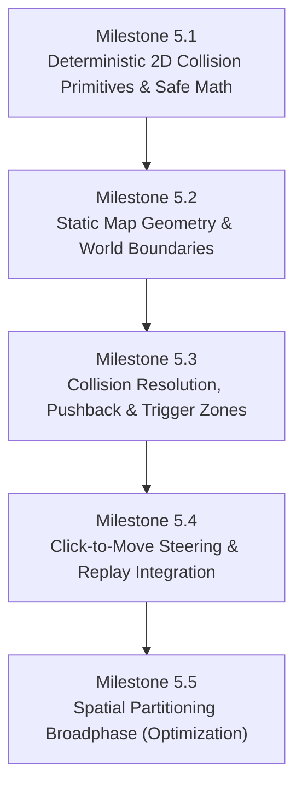

# Implementation Spec — Phase 5: Deterministic Physics & Collision Engine

> **Status:** Ready to Implement  
> **Roadmap Phase:** Phase 5 — Deterministic Physics & Collision Engine  
> **Reference ADRs:** [ADR-0001](../adr/en/0001-authoritative-server-archoitecture.md) · [ADR-0002](../adr/en/0002-instance-based-architecture.md) · [ADR-0003](../adr/en/0003-2d-map-only.md) · [ADR-0005](../adr/en/0005-cross-language-binary-serialization.md) · [ADR-0006](../adr/en/0006-two-thread-network-gameloop-separation.md) · [ADR-0007](../adr/en/0007-deterministic-simulation-and-fixed-point.md) · [ADR-0008](../adr/en/0008-session-lifecycle-and-client-identity.md) · [ADR-0010](../adr/en/0010-event-sourced-replay-format.md) · [ADR-0011](../adr/en/0011-authoritative-spectator-replay-broadcasting.md) · [ADR-0012](../adr/en/0012-deterministic-2d-collision-and-kinematic-resolution.md) · [ADR-0013](../adr/en/0013-server-authoritative-destination-steering-and-navigation.md)

---

## 1. Context & Technical Motivation

In **Phases 1–4**, `loci2d` established:
1. An authoritative single-instance game loop running over UDP with cross-language Protobuf serialization ([ADR-0001](../adr/en/0001-authoritative-server-archoitecture.md), [ADR-0005](../adr/en/0005-cross-language-binary-serialization.md), [ADR-0006](../adr/en/0006-two-thread-network-gameloop-separation.md)).
2. Client session mapping, timeouts, and multi-client state broadcasting ([ADR-0008](../adr/en/0008-session-lifecycle-and-client-identity.md)).
3. **100% bit-exact cross-platform determinism** via fixed-point arithmetic (`I16F16`), strictly ordered collections (`BTreeMap`), and event-sourced replay verification ([ADR-0007](../adr/en/0007-deterministic-simulation-and-fixed-point.md), [ADR-0010](../adr/en/0010-event-sourced-replay-format.md), [ADR-0011](../adr/en/0011-authoritative-spectator-replay-broadcasting.md)).

However, the current physics model in `Instance::tick()` is rudimentary:
$$\text{position} \leftarrow \text{position} + \text{velocity}$$

Entities can move infinitely into empty space, pass through each other without resistance, ignore map boundaries, and clip through hypothetical obstacles.

```
┌──────────────────────────────────────────────────────────────────────────────────────────────────┐
│ Evolution of Physics & Spatial Simulation in loci2d                                             │
│                                                                                                  │
│ [Phase 4: Free Unconstrained Movement]                                                           │
│ Client Intent ──► entity.velocity = dir ──► position += velocity (No colliders, no walls)       │
│                                                                                                  │
│ [Phase 5: Deterministic Authoritative 2D Physics & Collision Engine]                             │
│                                                                                                  │
│  Client Intent ──► Quantized Input (Move / MoveToPosition)                                       │
│                         │                                                                        │
│                         ▼                                                                        │
│               [Steering & Navigation] (Direct dir or Waypoint Pathfinding)                       │
│                         │                                                                        │
│                         ▼                                                                        │
│               [Velocity Integration] (Candidate Next Position)                                   │
│                         │                                                                        │
│                         ▼                                                                        │
│               [Map Boundary Constraint] (Clamp to Arena Limits by Collider Shape)                │
│                         │                                                                        │
│                         ▼                                                                        │
│               [Broadphase Query] (Spatial Hash Grid / BTree-Ordered Candidate Pairs)             │
│                         │                                                                        │
│                         ▼                                                                        │
│               [Narrowphase Detection] (Fixed-Point AABB / Circle Intersections)                  │
│                         │                                                                        │
│                         ├──► [Solid Collision Resolution] (MTV Pushback: 100% Static, 50/50 Dyn)│
│                         │                                                                        │
│                         └──► [Trigger / Sensor Zones] (Overlap Events: Enter / Stay / Exit)     │
│                                                                                                  │
│                         ▼ (Strict BTreeMap Order)                                                │
│               [Canonical WorldState Snapshot & Replay Hash Checkpoint]                           │
└──────────────────────────────────────────────────────────────────────────────────────────────────┘
```

### Core Goals of Phase 5
1. **Strict Determinism & Safe Math**: All collision math, distance calculations, and pushback resolutions use **fixed-point arithmetic (`I16F16`)** with **64-bit intermediate calculations** to guarantee bit-exact determinism without integer overflows across large arenas.
2. **2D Plane Only ([ADR-0003](../adr/en/0003-2d-map-only.md))**: Focus exclusively on 2D geometric shapes (AABB and Circles), avoiding unnecessary 3D spatial overhead.
3. **Solid Obstacles & Pushback**: Support static walls, arena perimeters, and dynamic entity collisions with smooth sliding response along surface tangents.
4. **Trigger / Sensor Zones**: Enable non-solid trigger volumes for gameplay events (e.g. entry/exit zone detection), providing the foundation for Phase 6 Lua scripting.
5. **Click-to-Move Navigation**: Implement destination-based movement (`MoveToPositionIntent`) with waypoint arrival tolerances for RTS/MOBA control schemes.

---

## 2. Architecture & 5 Sequential Milestones

Phase 5 is divided into **5 sequential milestones**:



---

### Milestone 5.1: Deterministic 2D Collision Primitives & Safe Math

All geometric shapes, vector operations, and intersection algorithms reside in `src/world/physics/`, operating on `I16F16` and `DeterministicVector2`.

#### 1. Geometric Primitive Definitions

```rust
use fixed::types::I16F16;
use crate::world::fixed_point::DeterministicVector2;

/// Axis-Aligned Bounding Box defined by min and max extents
#[derive(Debug, Clone, Copy, PartialEq, Eq, PartialOrd, Ord, Hash)]
pub struct DeterministicAABB {
    pub min: DeterministicVector2,
    pub max: DeterministicVector2,
}

impl DeterministicAABB {
    pub fn new(min: DeterministicVector2, max: DeterministicVector2) -> Self {
        assert!(min.x <= max.x && min.y <= max.y, "Invalid AABB bounds: min must be <= max");
        Self { min, max }
    }

    pub fn from_center_half_extents(center: DeterministicVector2, half_extents: DeterministicVector2) -> Self {
        Self {
            min: DeterministicVector2::new(
                center.x.saturating_sub(half_extents.x),
                center.y.saturating_sub(half_extents.y),
            ),
            max: DeterministicVector2::new(
                center.x.saturating_add(half_extents.x),
                center.y.saturating_add(half_extents.y),
            ),
        }
    }

    pub fn width(&self) -> I16F16 { self.max.x - self.min.x }
    pub fn height(&self) -> I16F16 { self.max.y - self.min.y }
    pub fn center(&self) -> DeterministicVector2 {
        DeterministicVector2::new((self.min.x + self.max.x) / 2, (self.min.y + self.max.y) / 2)
    }
    pub fn half_extents(&self) -> DeterministicVector2 {
        DeterministicVector2::new(self.width() / 2, self.height() / 2)
    }
}

/// Circle collider defined by center position and radius
#[derive(Debug, Clone, Copy, PartialEq, Eq, PartialOrd, Ord, Hash)]
pub struct DeterministicCircle {
    pub center: DeterministicVector2,
    pub radius: I16F16,
}

impl DeterministicCircle {
    pub fn new(center: DeterministicVector2, radius: I16F16) -> Self {
        assert!(radius >= I16F16::ZERO, "Collider radius must be non-negative");
        Self { center, radius }
    }
}

/// Unified Collider Shape representation
#[derive(Debug, Clone, Copy, PartialEq, Eq, PartialOrd, Ord, Hash)]
pub enum ColliderShape {
    AABB(DeterministicAABB),
    Circle(DeterministicCircle),
}
```

#### 2. Vector Arithmetic Extensions on `DeterministicVector2`

`src/world/fixed_point.rs` is expanded with full arithmetic traits and vector helpers:
- `Div<I16F16>` and `DivAssign<I16F16>`
- `dot(&self, other: Self) -> I16F16`
- `normalize_or_zero(&self) -> Self`
- `distance(&self, other: Self) -> I16F16`

#### 3. Overflow-Safe Distance Calculation & Restoring Square Root

> [!CAUTION]
> **Fixed-Point Intermediate Overflow**: In `I16F16`, the maximum representable value is $32,767.99998$. Squaring a distance $\Delta \ge \sqrt{32767} \approx 181.01$ directly inside `I16F16` overflows and saturates. For example, two entities at $(-300, -300)$ and $(300, 300)$ have $\Delta_x = 600$, where $600^2 = 360,000$, exceeding `I16F16::MAX`.

To completely prevent overflow, distance and square root operations execute using **64-bit integer arithmetic** on raw bit representations:

```rust
/// Pure integer digit-by-digit restoring square root for 64-bit unsigned integers
pub fn integer_sqrt_u64(val: u64) -> u64 {
    if val == 0 {
        return 0;
    }
    let mut root = 0u64;
    let mut bit = 1u64 << 62; // Highest power of 4 fitting in u64

    while bit > val {
        bit >>= 2;
    }

    let mut remainder = val;
    while bit != 0 {
        if remainder >= root + bit {
            remainder -= root + bit;
            root = (root >> 1) + bit;
        } else {
            root >>= 1;
        }
        bit >>= 2;
    }
    root
}

/// Deterministic fixed-point square root for I16F16 values
pub fn fixed_sqrt(val: I16F16) -> I16F16 {
    if val <= I16F16::ZERO {
        return I16F16::ZERO;
    }
    // Scale raw representation (val * 2^16) by 2^16 so integer sqrt returns raw fixed-point bits
    let scaled = (val.to_bits() as u64) << 16;
    let root = integer_sqrt_u64(scaled);
    I16F16::from_bits(root as i32)
}

/// Overflow-safe Euclidean distance between two points (safe for distances up to ~46,000 units)
pub fn deterministic_distance(a: DeterministicVector2, b: DeterministicVector2) -> I16F16 {
    let dx_raw = (a.x.to_bits() as i64) - (b.x.to_bits() as i64);
    let dy_raw = (a.y.to_bits() as i64) - (b.y.to_bits() as i64);
    let dist_sq_raw = (dx_raw * dx_raw + dy_raw * dy_raw) as u64;

    // Sqrt of raw squared distance directly gives raw I16F16 representation:
    // sqrt((dx * 2^16)^2 + (dy * 2^16)^2) = sqrt(dist^2 * 2^32) = dist * 2^16
    let root_raw = integer_sqrt_u64(dist_sq_raw);
    I16F16::from_bits(root_raw as i32)
}
```

#### 4. Intersection Tests & Manifold (MTV) Calculation

We define a `ContactManifold` that describes whether two shapes collide and the **Minimum Translation Vector (MTV)** required to separate them:

```rust
#[derive(Debug, Clone, Copy, PartialEq, Eq)]
pub struct ContactManifold {
    pub is_colliding: bool,
    pub normal: DeterministicVector2, // Separation direction (points from B to A)
    pub penetration_depth: I16F16,     // Distance to push A out of B
}

impl ContactManifold {
    pub const NONE: Self = Self {
        is_colliding: false,
        normal: DeterministicVector2::ZERO,
        penetration_depth: I16F16::ZERO,
    };
}
```

* **AABB vs AABB**:
  Calculate overlap on X and Y axes:
  $$\text{overlap}_x = \min(A.\text{max.x}, B.\text{max.x}) - \max(A.\text{min.x}, B.\text{min.x})$$
  $$\text{overlap}_y = \min(A.\text{max.y}, B.\text{max.y}) - \max(A.\text{min.y}, B.\text{min.y})$$
  If both $\text{overlap}_x > 0$ and $\text{overlap}_y > 0$, the shapes intersect:
  - If $A.\text{center} == B.\text{center}$: Fallback deterministic normal $\vec{n} = (1, 0)$ with penetration depth $\text{overlap}_x$.
  - Else if $\text{overlap}_x < \text{overlap}_y$: normal is $(\text{sign}(A.\text{center.x} - B.\text{center.x}), 0)$, depth is $\text{overlap}_x$.
  - Else: normal is $(0, \text{sign}(A.\text{center.y} - B.\text{center.y}))$, depth is $\text{overlap}_y$.

* **Circle vs Circle**:
  $$\text{dist} = \text{deterministic\_distance}(A.\text{center}, B.\text{center})$$
  $$\text{radii\_sum} = A.\text{radius} + B.\text{radius}$$
  Intersection occurs when $\text{dist} < \text{radii\_sum}$:
  - **Zero-Distance Fallback**: If $\text{dist} == 0$ (identical centers), normal is $\vec{n} = (1, 0)$ and penetration depth is $\text{radii\_sum}$.
  - **Normal Separation**: When $\text{dist} > 0$, normal is $(A.\text{center} - B.\text{center}) / \text{dist}$, and penetration depth is $\text{radii\_sum} - \text{dist}$.

* **AABB vs Circle**:
  Clamp the circle's center to the AABB's bounds to find the closest point $P$:
  $$P_x = \text{clamp}(\text{circle.x}, AABB.\text{min.x}, AABB.\text{max.x})$$
  $$P_y = \text{clamp}(\text{circle.y}, AABB.\text{min.y}, AABB.\text{max.y})$$
  - **Circle Center Outside AABB ($P \ne \text{center}$)**: $\text{dist} = \text{deterministic\_distance}(\text{center}, P)$. If $\text{dist} < \text{radius}$, normal is $(\text{center} - P) / \text{dist}$, depth is $\text{radius} - \text{dist}$.
  - **Circle Center Inside AABB ($P == \text{center}$)**: Calculate distance to all 4 outer edges:
    $$\text{dist\_left} = \text{center.x} - AABB.\text{min.x}, \quad \text{dist\_right} = AABB.\text{max.x} - \text{center.x}$$
    $$\text{dist\_bottom} = \text{center.y} - AABB.\text{min.y}, \quad \text{dist\_top} = AABB.\text{max.y} - \text{center.y}$$
    Find minimum distance with deterministic tie-break ordering ($+X, -X, +Y, -Y$). Normal points toward the closest edge, depth is $\text{radius} + \text{min\_edge\_dist}$.

---

### Milestone 5.2: Static Map Geometry & World Boundaries

#### 1. Map Boundaries & Multi-Shape Clamping
Every `Instance` gains configurable map boundaries. Clamping supports points, circles, and AABBs:

```rust
#[derive(Debug, Clone, Copy, PartialEq, Eq)]
pub struct MapBounds {
    pub min: DeterministicVector2,
    pub max: DeterministicVector2,
}

impl MapBounds {
    pub fn new(min: DeterministicVector2, max: DeterministicVector2) -> Self {
        assert!(min.x <= max.x && min.y <= max.y, "Invalid map bounds");
        Self { min, max }
    }

    pub fn default_arena() -> Self {
        Self {
            min: DeterministicVector2::new(I16F16::from_num(-500), I16F16::from_num(-500)),
            max: DeterministicVector2::new(I16F16::from_num(500), I16F16::from_num(500)),
        }
    }

    pub fn clamp_point(&self, point: DeterministicVector2) -> DeterministicVector2 {
        DeterministicVector2::new(point.x.clamp(self.min.x, self.max.x), point.y.clamp(self.min.y, self.max.y))
    }

    pub fn clamp_circle(&self, center: DeterministicVector2, radius: I16F16) -> DeterministicVector2 {
        let min_x = (self.min.x + radius).min(self.max.x);
        let max_x = (self.max.x - radius).max(self.min.x);
        let min_y = (self.min.y + radius).min(self.max.y);
        let max_y = (self.max.y - radius).max(self.min.y);
        DeterministicVector2::new(center.x.clamp(min_x, max_x), center.y.clamp(min_y, max_y))
    }

    pub fn clamp_aabb(&self, center: DeterministicVector2, half_extents: DeterministicVector2) -> DeterministicVector2 {
        let min_x = (self.min.x + half_extents.x).min(self.max.x);
        let max_x = (self.max.x - half_extents.x).max(self.min.x);
        let min_y = (self.min.y + half_extents.y).min(self.max.y);
        let max_y = (self.max.y - half_extents.y).max(self.min.y);
        DeterministicVector2::new(center.x.clamp(min_x, max_x), center.y.clamp(min_y, max_y))
    }
}
```

#### 2. Static Obstacle Definitions & Ordered Storage
Static obstacles (walls, pillars, terrain blockers) are stored in `BTreeMap<u64, StaticObstacle>`:

```rust
#[derive(Debug, Clone, PartialEq, Eq)]
pub struct StaticObstacle {
    pub id: u64,
    pub shape: ColliderShape,
    pub filter: CollisionFilter,
    pub is_solid: bool, // True for walls, False for trigger sensors
}
```

---

### Milestone 5.3: Collision Resolution, Dynamic Pushback & Trigger Zones

#### 1. Collision Layers & Masks
Entities and obstacles use 16-bit bitmask filtering:

```rust
#[derive(Debug, Clone, Copy, PartialEq, Eq, PartialOrd, Ord, Hash)]
pub struct CollisionFilter {
    pub layer: u16,
    pub mask: u16,
}

impl CollisionFilter {
    pub const NONE: u16 = 0;
    pub const SOLID_WALL: u16 = 1 << 0;
    pub const PLAYER: u16 = 1 << 1;
    pub const TRIGGER_ZONE: u16 = 1 << 2;
    pub const PROJECTILE: u16 = 1 << 3;

    pub fn can_collide(&self, other: &Self) -> bool {
        (self.mask & other.layer) != 0 && (other.mask & self.layer) != 0
    }
}
```

#### 2. Minimum Translation Vector (MTV) Pushback & Wall Sliding

Pushback differs between dynamic-static and dynamic-dynamic interactions:

* **Dynamic vs Static (100% Pushback to Entity)**:
  $$\text{pos} \mathrel{+}= \vec{n} \times \text{depth}$$
  $$\vec{v}_{\text{slide}} = \vec{v} - (\vec{v} \cdot \vec{n}) \vec{n} \quad (\text{if } \vec{v} \cdot \vec{n} < 0)$$

* **Dynamic vs Dynamic (50/50 Split Pushback)**:
  $$\text{pos}_A \mathrel{+}= \vec{n} \times \frac{\text{depth}}{2}, \quad \text{pos}_B \mathrel{-}= \vec{n} \times \frac{\text{depth}}{2}$$

```rust
pub fn resolve_static_collision(
    pos: &mut DeterministicVector2,
    vel: &mut DeterministicVector2,
    manifold: &ContactManifold,
) {
    if !manifold.is_colliding || manifold.penetration_depth <= I16F16::ZERO {
        return;
    }
    if manifold.normal == DeterministicVector2::ZERO {
        return;
    }

    pos.x += manifold.normal.x * manifold.penetration_depth;
    pos.y += manifold.normal.y * manifold.penetration_depth;

    let dot = vel.dot(manifold.normal);
    if dot < I16F16::ZERO {
        vel.x -= manifold.normal.x * dot;
        vel.y -= manifold.normal.y * dot;
    }
}

pub fn resolve_dynamic_collision(
    pos_a: &mut DeterministicVector2,
    vel_a: &mut DeterministicVector2,
    pos_b: &mut DeterministicVector2,
    vel_b: &mut DeterministicVector2,
    manifold: &ContactManifold,
) {
    if !manifold.is_colliding || manifold.penetration_depth <= I16F16::ZERO {
        return;
    }
    if manifold.normal == DeterministicVector2::ZERO {
        return;
    }

    // Fixing LSB (Least Significant Bit) loss in division
    let half_depth = manifold.penetration_depth / 2;
    let remainder = manifold.penetration_depth - (half_depth * I16F16::from_num(2));
    let push_a = half_depth + remainder; // Ensuring 100% separation
    let push_b = half_depth;

    pos_a.x += manifold.normal.x * push_a;
    pos_a.y += manifold.normal.y * push_a;
    pos_b.x -= manifold.normal.x * push_b;
    pos_b.y -= manifold.normal.y * push_b;

    let dot_a = vel_a.dot(manifold.normal);
    if dot_a < I16F16::ZERO {
        vel_a.x -= manifold.normal.x * dot_a;
        vel_a.y -= manifold.normal.y * dot_a;
    }

    let dot_b = vel_b.dot(-manifold.normal);
    if dot_b < I16F16::ZERO {
        vel_b.x += manifold.normal.x * dot_b;
        vel_b.y += manifold.normal.y * dot_b;
    }
}
```

#### 3. Deterministic Trigger Zone State Management
`Instance` tracks active and previous overlaps to generate lifecycle events:

```rust
#[derive(Debug, Clone, Copy, PartialEq, Eq, PartialOrd, Ord)]
pub enum TriggerEventType {
    Enter,
    Stay,
    Exit,
}

#[derive(Debug, Clone, PartialEq, Eq, PartialOrd, Ord)]
pub struct TriggerEvent {
    pub trigger_id: u64,
    pub entity_id: u64,
    pub event_type: TriggerEventType,
    pub tick: u64,
}
```

`Instance` state fields:
```rust
pub active_trigger_overlaps: BTreeSet<(u64, u64)>,
pub previous_trigger_overlaps: BTreeSet<(u64, u64)>,
pub trigger_events: Vec<TriggerEvent>,
```

#### 4. Tunneling Prevention & Raycasting
For fast projectiles, discrete stepping is replaced with line-segment raycasts:

```rust
#[derive(Debug, Clone, Copy, PartialEq, Eq)]
pub struct RaycastHit {
    pub point: DeterministicVector2,
    pub normal: DeterministicVector2,
    pub fraction: I16F16, // Range [0.0, 1.0]
    pub obstacle_id: u64,
}

pub fn fixed_raycast(
    origin: DeterministicVector2,
    direction: DeterministicVector2,
    max_distance: I16F16,
    obstacles: &BTreeMap<u64, StaticObstacle>,
) -> Option<RaycastHit>;
```

---

### Milestone 5.4: Click-to-Move Steering & Replay Integration

#### 1. Navigation State Component

```rust
#[derive(Debug, Clone, PartialEq, Eq)]
pub struct NavigationComponent {
    pub target: Option<DeterministicVector2>,
    pub arrival_tolerance: I16F16, // Recommended >= move_speed
    pub move_speed: I16F16,
    pub waypoints: Vec<DeterministicVector2>,
    pub current_waypoint_index: usize,
}

impl NavigationComponent {
    pub fn new(move_speed: I16F16, arrival_tolerance: I16F16) -> Self {
        Self {
            target: None,
            arrival_tolerance,
            move_speed,
            waypoints: Vec::new(),
            current_waypoint_index: 0,
        }
    }
}
```

#### 2. Replay Player Intent Dispatch (`src/replay/player.rs`)

> [!IMPORTANT]
> **Replay Engine Integration**: `ReplayPlayer` must process `Intent::MoveToPos` just like live network packets to preserve match reproducibility across replays.
> **Fixed-Point Strictness**: The `.proto` must use integer values (e.g. `int32 x_bits` and `int32 y_bits`) rather than `float`. Converting `f32` inside the logic breaks cross-platform determinism (ADR-0007).

```rust
// Inside ReplayPlayer::apply_replay_entry / Instance::apply_replay_intent:
Intent::MoveToPos(move_to_pos_intent) => {
    if let Some(target) = move_to_pos_intent.target_position {
        if let Some(entity) = self.entities.get_mut(&entity_id) {
            // Direct bit-construction avoids float conversions from FPU entirely
            let target_vec = DeterministicVector2::new(
                I16F16::from_bits(target.x_bits),
                I16F16::from_bits(target.y_bits)
            );
            if let Some(ref mut nav) = entity.navigation {
                nav.target = Some(target_vec);
                nav.waypoints.clear();
                nav.current_waypoint_index = 0;
            }
        }
    }
}
```

---

### Milestone 5.5: Spatial Partitioning Broadphase (Optional Optimization)

1. **2D Uniform Spatial Hash Grid**: Configurable cell size in `InstanceConfig` (default $64 \times 64$ units).
2. **Candidate Pair Deduplication (Cache-Friendly)**: Normalizes entity IDs (`min_id < max_id`) into a flat `Vec<(u64, u64)>`. To avoid allocation bottlenecks on the single Game-Loop thread, pairs are sorted via `.sort_unstable()` and deduplicated with `.dedup()`, completely replacing `BTreeSet` for performance.
3. **Execution**: Narrowphase tests run strictly on the sorted vector of candidate pairs.

---

## 3. Integration with Existing Systems

### 3.1 Entity Model (`src/world/entity.rs`)

```rust
pub struct Entity {
    pub id: u64,
    pub name: String,
    pub entity_type: EntityType,
    pub position: DeterministicVector2,
    pub velocity: DeterministicVector2,
    // Phase 5 Additions:
    pub collider: Option<ColliderShape>,
    pub collision_filter: CollisionFilter,
    pub navigation: Option<NavigationComponent>,
}
```

### 3.2 Instance Model (`src/world/instance.rs`)

```rust
pub struct Instance {
    pub id: u64,
    pub entities: BTreeMap<u64, Entity>,
    pub sessions: BTreeMap<SocketAddr, ClientSession>,
    pub entity_to_addr: BTreeMap<u64, SocketAddr>,
    pub tick_rate: u32,
    pub client_timeout_secs: u64,
    // Phase 5 Additions:
    pub map_bounds: MapBounds,
    pub static_obstacles: BTreeMap<u64, StaticObstacle>,
    pub active_trigger_overlaps: BTreeSet<(u64, u64)>,
    pub previous_trigger_overlaps: BTreeSet<(u64, u64)>,
    pub trigger_events: Vec<TriggerEvent>,
    next_entity_id: u64,
    next_session_id: u64,
}
```

---

## 4. Verification Plan & Test Matrix

| Test Suite | Focus Area | Verification Method |
|---|---|---|
| **Unit Tests** (`tests/physics_primitives_test.rs`) | Fixed-point math & primitive intersections | Test AABB-AABB, Circle-Circle, AABB-Circle, zero-distance edge cases, and integer `fixed_sqrt` |
| **Overflow Tests** (`tests/physics_overflow_test.rs`) | Extreme coordinates ($> 181$ units) | Assert `deterministic_distance` operates flawlessly on points $> 1000$ units apart without overflow |
| **Collision Resolution Tests** (`tests/physics_collision_resolution_test.rs`) | Pushback & wall sliding | Verify static 100% pushback and dynamic 50/50 split pushback |
| **Navigation Tests** (`tests/physics_navigation_test.rs`) | Click-to-move arrival & waypoints | Verify entity reaches target coordinate within arrival tolerance without oscillation |
| **Cross-Platform Replay Verification** (`loci-replay`) | Bit-exact determinism with active physics | Run `loci-replay` on recorded match with collisions & navigation; assert identical SHA-256 checksums across runs |

---

## 5. File Structure Changes

```
src/
├── world/
│   ├── entity.rs           # Updated with Collider, CollisionFilter, NavigationComponent
│   ├── fixed_point.rs      # Expanded with Div, dot, normalize_or_zero, deterministic_distance
│   ├── instance.rs         # Updated tick() pipeline with collision, trigger, and navigation steps
│   ├── mod.rs
│   ├── session.rs
│   └── physics/            # [NEW] Phase 5 Physics & Collision Engine
│       ├── mod.rs          # Re-exports and high-level query helpers
│       ├── primitives.rs   # DeterministicAABB, DeterministicCircle, ColliderShape
│       ├── math.rs         # integer_sqrt_u64, fixed_sqrt, deterministic_distance
│       ├── collision.rs    # Intersection tests, ContactManifold, MTV resolution
│       ├── map.rs          # MapBounds, StaticObstacle, TriggerZone
│       ├── navigation.rs   # NavigationComponent, steering and waypoint logic
│       └── spatial_grid.rs # Optional fixed-size spatial hash grid
```

---

## 6. Definition of Done Checklist

- [x] **Milestone 5.1**: `DeterministicAABB`, `DeterministicCircle`, restoring `fixed_sqrt`, `deterministic_distance` (overflow-safe for distances $> 181$), and all 2D intersection queries implemented with 100% passing tests.
- [x] **Milestone 5.2**: `MapBounds` (with `clamp_point`, `clamp_circle`, `clamp_aabb`) and `StaticObstacle` definitions integrated into `Instance` in `BTreeMap` order.
- [x] **Milestone 5.3**: Solid MTV pushback (100% static, 50/50 dynamic) and wall sliding implemented; trigger zone `Enter`/`Stay`/`Exit` events functioning with deterministic `BTreeSet` order.
- [ ] **Milestone 5.4**: `MoveToPositionIntent` click-to-move navigation and waypoint steering functioning without jitter; `ReplayPlayer` replay intent dispatch integrated.
- [ ] **Milestone 5.5**: Broadphase spatial grid implemented and verified against brute-force baseline.
- [ ] **Determinism Verified**: Replay CLI (`loci-replay`) validates identical SHA-256 state hashes for matches containing complex collisions and navigation paths.
