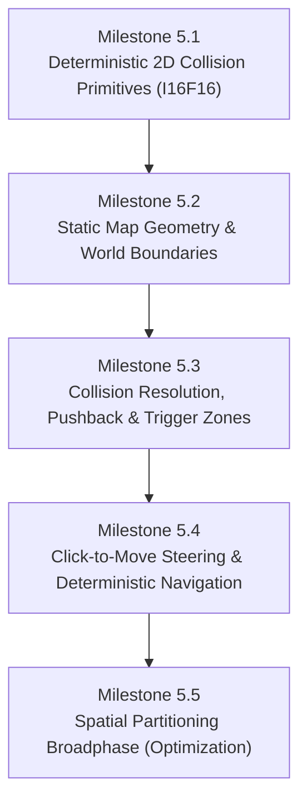

# Implementation Spec — Phase 5: Deterministic Physics & Collision Engine

> **Status:** Ready to Implement  
> **Roadmap Phase:** Phase 5 — Deterministic Physics & Collision Engine  
> **Reference ADRs:** [ADR-0001](../adr/en/0001-authoritative-server-archoitecture.md) · [ADR-0002](../adr/en/0002-instance-based-architecture.md) · [ADR-0003](../adr/en/0003-2d-map-only.md) · [ADR-0005](../adr/en/0005-cross-language-binary-serialization.md) · [ADR-0006](../adr/en/0006-two-thread-network-gameloop-separation.md) · [ADR-0007](../adr/en/0007-deterministic-simulation-and-fixed-point.md) · [ADR-0008](../adr/en/0008-session-lifecycle-and-client-identity.md) · [ADR-0010](../adr/en/0010-event-sourced-replay-format.md) · [ADR-0011](../adr/en/0011-authoritative-spectator-replay-broadcasting.md) · [ADR-0012](../adr/en/0012-deterministic-2d-collision-and-kinematic-resolution.md) · [ADR-0013](../adr/en/0013-server-authoritative-destination-steering-and-navigation.md)

---

## 1. Context & Technical Motivation

In **Phases 1–4**, `loci2d` established:
1. An authoritative single-instance game loop running over UDP with cross-language Protobuf serialization ([ADR-0001](../adr/en/0001-authoritative-server-archoitecture.md), [ADR-0005](../adr/en/0005-cross-language-binary-serialization.md), [ADR-0006](../adr/en/0006-two-thread-network-gameloop-separation.md)).
2. Client session mapping, timeouts, and multi-client state broadcasting ([ADR-0008](../adr/en/0008-session-lifecycle-and-client-identity.md)).
3. **100% bit-exact cross-platform determinism** via fixed-point arithmetic (`I16F16`), strictly ordered collections (`BTreeMap`), and event-sourced replay verification ([ADR-0007](../adr/en/0007-deterministic-simulation-and-fixed-point.md), [ADR-0010](../adr/en/0010-event-sourced-replay-format.md), [ADR-0011](../adr/en/0011-authoritative-spectator-replay-broadcasting.md)).

However, the current physics model in `Instance::tick()` is rudimentary:
$$\text{position} \leftarrow \text{position} + \text{velocity}$$

Entities can move infinitely into empty space, pass through each other without resistance, ignore map boundaries, and clip through hypothetical obstacles.

```
┌──────────────────────────────────────────────────────────────────────────────────────────────────┐
│ Evolution of Physics & Spatial Simulation in loci2d                                             │
│                                                                                                  │
│ [Phase 4: Free Unconstrained Movement]                                                           │
│ Client Intent ──► entity.velocity = dir ──► position += velocity (No colliders, no walls)       │
│                                                                                                  │
│ [Phase 5: Deterministic Authoritative 2D Physics & Collision Engine]                             │
│                                                                                                  │
│  Client Intent ──► Quantized Input (Move / MoveToPosition)                                       │
│                         │                                                                        │
│                         ▼                                                                        │
│               [Steering & Navigation] (Direct dir or Waypoint Pathfinding)                       │
│                         │                                                                        │
│                         ▼                                                                        │
│               [Velocity Integration] (Candidate Next Position)                                   │
│                         │                                                                        │
│                         ▼                                                                        │
│               [Map Boundary Constraint] (Clamp to Arena Limits)                                  │
│                         │                                                                        │
│                         ▼                                                                        │
│               [Broadphase Query] (Spatial Hash Grid / Bounded Pairs)                             │
│                         │                                                                        │
│                         ▼                                                                        │
│               [Narrowphase Detection] (Fixed-Point AABB / Circle Intersections)                  │
│                         │                                                                        │
│                         ├──► [Solid Collision Resolution] (MTV Pushback & Wall Sliding)         │
│                         │                                                                        │
│                         └──► [Trigger / Sensor Zones] (Overlap Events: Enter / Stay / Exit)     │
│                                                                                                  │
│                         ▼ (Strict BTreeMap Order)                                                │
│               [Canonical WorldState Snapshot & Replay Hash Checkpoint]                           │
└──────────────────────────────────────────────────────────────────────────────────────────────────┘
```

### Core Goals of Phase 5
1. **Strict Determinism**: All collision math, intersection queries, distance calculations, and pushback resolutions must use **pure fixed-point arithmetic (`I16F16`)** to maintain bit-exact match replay parity across Linux, macOS, and Windows.
2. **2D Plane Only ([ADR-0003](../adr/en/0003-2d-map-only.md))**: Focus exclusively on 2D geometric shapes (AABB and Circles), avoiding unnecessary 3D spatial overhead.
3. **Solid Obstacles & Pushback**: Support static walls, arena perimeters, and dynamic entity collisions with smooth sliding response along surface tangents.
4. **Trigger / Sensor Zones**: Enable non-solid trigger volumes for gameplay events (e.g. entry/exit zone detection), providing the foundation for Phase 6 Lua scripting.
5. **Click-to-Move Navigation**: Implement destination-based movement (`MoveToPositionIntent`) with waypoint arrival tolerances for RTS/MOBA control schemes.

---

## 2. Architecture & 5 Sequential Milestones

Phase 5 is divided into **5 sequential milestones**:



---

### Milestone 5.1: Deterministic 2D Collision Primitives (`I16F16`)

All geometric shapes and intersection algorithms reside in a new module `src/world/physics/` (or `src/physics/`), operating purely on `I16F16` and `DeterministicVector2`.

#### 1. Geometric Primitive Definitions

```rust
use fixed::types::I16F16;
use crate::world::fixed_point::DeterministicVector2;

/// Axis-Aligned Bounding Box defined by min and max extents
#[derive(Debug, Clone, Copy, PartialEq, Eq, PartialOrd, Ord, Hash)]
pub struct DeterministicAABB {
    pub min: DeterministicVector2,
    pub max: DeterministicVector2,
}

impl DeterministicAABB {
    pub fn new(min: DeterministicVector2, max: DeterministicVector2) -> Self {
        debug_assert!(min.x <= max.x && min.y <= max.y, "Invalid AABB bounds");
        Self { min, max }
    }

    pub fn from_center_half_extents(center: DeterministicVector2, half_extents: DeterministicVector2) -> Self {
        Self {
            min: DeterministicVector2::new(
                center.x.saturating_sub(half_extents.x),
                center.y.saturating_sub(half_extents.y),
            ),
            max: DeterministicVector2::new(
                center.x.saturating_add(half_extents.x),
                center.y.saturating_add(half_extents.y),
            ),
        }
    }

    pub fn width(&self) -> I16F16 { self.max.x - self.min.x }
    pub fn height(&self) -> I16F16 { self.max.y - self.min.y }
    pub fn center(&self) -> DeterministicVector2 {
        DeterministicVector2::new((self.min.x + self.max.x) / 2, (self.min.y + self.max.y) / 2)
    }
}

/// Circle collider defined by center position and radius
#[derive(Debug, Clone, Copy, PartialEq, Eq, PartialOrd, Ord, Hash)]
pub struct DeterministicCircle {
    pub center: DeterministicVector2,
    pub radius: I16F16,
}

impl DeterministicCircle {
    pub fn new(center: DeterministicVector2, radius: I16F16) -> Self {
        Self { center, radius }
    }

    pub fn radius_squared(&self) -> I16F16 {
        self.radius * self.radius
    }
}

/// Unified Collider Shape representation
#[derive(Debug, Clone, Copy, PartialEq, Eq, PartialOrd, Ord, Hash)]
pub enum ColliderShape {
    AABB(DeterministicAABB),
    Circle(DeterministicCircle),
}
```

#### 2. Deterministic Integer Math Utilities (`fixed_sqrt`)

Circle intersection and distance queries require square roots. To avoid floating-point non-determinism (`f32::sqrt`), we implement a deterministic integer-based square root for `I16F16`:

```rust
/// Deterministic fixed-point square root using integer bitwise method
pub fn fixed_sqrt(val: I16F16) -> I16F16 {
    if val <= I16F16::ZERO {
        return I16F16::ZERO;
    }
    // Convert I16F16 raw representation (scaled by 2^16) to 64-bit integer
    // sqrt(x * 2^16) = sqrt(x * 2^32) / 2^8 -> We scale raw by 2^16 to compute fixed sqrt
    let raw = val.to_bits() as u64;
    let scaled = raw << 16;
    let mut root = 0u64;
    let mut bit = 1u64 << 46; // Highest power of 4 fitting in u64

    while bit > scaled {
        bit >>= 2;
    }

    while bit != 0 {
        if scaled >= root + bit {
            let temp = root + bit;
            root = (root >> 1) + bit;
            // Subtract using intermediate to satisfy integer algorithm
        } else {
            root >>= 1;
        }
        bit >>= 2;
    }

    I16F16::from_bits(root as i32)
}
```

#### 3. Intersection Tests & Manifold (MTV) Calculation

We define a `ContactManifold` that describes whether two shapes collide and the **Minimum Translation Vector (MTV)** required to separate them:

```rust
#[derive(Debug, Clone, Copy, PartialEq, Eq)]
pub struct ContactManifold {
    pub is_colliding: bool,
    pub normal: DeterministicVector2, // Separation direction (points from B to A)
    pub penetration_depth: I16F16,     // Distance to push A out of B
}

impl ContactManifold {
    pub const NONE: Self = Self {
        is_colliding: false,
        normal: DeterministicVector2::ZERO,
        penetration_depth: I16F16::ZERO,
    };
}
```

* **AABB vs AABB**:
  Calculate overlap on X and Y axes:
  $$\text{overlap}_x = \min(A.\text{max.x}, B.\text{max.x}) - \max(A.\text{min.x}, B.\text{min.x})$$
  $$\text{overlap}_y = \min(A.\text{max.y}, B.\text{max.y}) - \max(A.\text{min.y}, B.\text{min.y})$$
  If both $\text{overlap}_x > 0$ and $\text{overlap}_y > 0$, the shapes intersect. The minimum penetration axis determines the normal.

* **Circle vs Circle**:
  $$\Delta = A.\text{center} - B.\text{center}$$
  $$\text{dist\_sq} = \Delta_x^2 + \Delta_y^2$$
  $$\text{radii\_sum} = A.\text{radius} + B.\text{radius}$$
  Intersection occurs when $\text{dist\_sq} < \text{radii\_sum}^2$. Separation normal is $\Delta / \text{dist}$.

* **AABB vs Circle**:
  Clamp the circle's center to the AABB's bounds to find the closest point $P$:
  $$P_x = \text{clamp}(\text{circle.x}, AABB.\text{min.x}, AABB.\text{max.x})$$
  $$P_y = \text{clamp}(\text{circle.y}, AABB.\text{min.y}, AABB.\text{max.y})$$
  Test distance from circle center to point $P$.

---

### Milestone 5.2: Static Map Geometry & World Boundaries

#### 1. Map Boundaries & Arena Containment
Every `Instance` gains configurable map boundaries. Entity positions are clamped during simulation steps:

```rust
#[derive(Debug, Clone, Copy, PartialEq, Eq)]
pub struct MapBounds {
    pub min: DeterministicVector2,
    pub max: DeterministicVector2,
}

impl MapBounds {
    pub fn default_arena() -> Self {
        Self {
            min: DeterministicVector2::new(I16F16::from_num(-500), I16F16::from_num(-500)),
            max: DeterministicVector2::new(I16F16::from_num(500), I16F16::from_num(500)),
        }
    }

    pub fn clamp(&self, point: DeterministicVector2, radius: I16F16) -> DeterministicVector2 {
        let min_x = self.min.x + radius;
        let max_x = self.max.x - radius;
        let min_y = self.min.y + radius;
        let max_y = self.max.y - radius;

        DeterministicVector2::new(
            point.x.clamp(min_x, max_x),
            point.y.clamp(min_y, max_y),
        )
    }
}
```

#### 2. Static Obstacle Definitions
Static obstacles (walls, pillars, terrain blockers) are immutable colliders registered on map load:

```rust
#[derive(Debug, Clone, PartialEq, Eq)]
pub struct StaticObstacle {
    pub id: u64,
    pub shape: ColliderShape,
    pub is_solid: bool, // True for walls, False for trigger sensors
}
```

---

### Milestone 5.3: Collision Resolution, Dynamic Pushback & Trigger Zones

#### 1. Collision Layers & Masks
To control what collides with what (e.g. players collide with walls and other players, but trigger zones only generate events):

```rust
#[derive(Debug, Clone, Copy, PartialEq, Eq, PartialOrd, Ord, Hash)]
pub struct CollisionFilter {
    pub layer: u16, // Bitmask representing this entity's category
    pub mask: u16,  // Bitmask representing categories this entity interacts with
}

impl CollisionFilter {
    pub const NONE: u16 = 0;
    pub const SOLID_WALL: u16 = 1 << 0;
    pub const PLAYER: u16 = 1 << 1;
    pub const TRIGGER_ZONE: u16 = 1 << 2;
    pub const PROJECTILE: u16 = 1 << 3;

    pub fn can_collide(&self, other_layer: u16) -> bool {
        (self.mask & other_layer) != 0
    }
}
```

#### 2. Minimum Translation Vector (MTV) Pushback & Wall Sliding
When an entity moves towards a solid obstacle, rather than abruptly halting all velocity (which feels clunky and causes player snagging), the velocity and position are projected along the collision surface tangent:

$$\vec{v}_{\text{slide}} = \vec{v} - (\vec{v} \cdot \vec{n}) \vec{n}$$

```rust
/// Applies position pushback and slides velocity along collision normal
pub fn resolve_solid_collision(
    pos: &mut DeterministicVector2,
    vel: &mut DeterministicVector2,
    manifold: &ContactManifold,
) {
    if !manifold.is_colliding || manifold.penetration_depth <= I16F16::ZERO {
        return;
    }

    // 1. Position Separation: Push entity out along the normal by penetration depth
    pos.x += manifold.normal.x * manifold.penetration_depth;
    pos.y += manifold.normal.y * manifold.penetration_depth;

    // 2. Velocity Deflection (Wall Slide): Remove normal velocity component
    let dot = vel.x * manifold.normal.x + vel.y * manifold.normal.y;
    if dot < I16F16::ZERO {
        vel.x -= manifold.normal.x * dot;
        vel.y -= manifold.normal.y * dot;
    }
}
```

#### 3. Trigger & Sensor Zones
Non-solid volumes detect when entities enter, remain inside, or exit:

```rust
#[derive(Debug, Clone, Copy, PartialEq, Eq)]
pub enum TriggerEventType {
    Enter,
    Stay,
    Exit,
}

#[derive(Debug, Clone, PartialEq, Eq)]
pub struct TriggerEvent {
    pub trigger_id: u64,
    pub entity_id: u64,
    pub event_type: TriggerEventType,
    pub tick: u64,
}
```

On every tick, `Instance` maintains a `BTreeSet<(u64, u64)>` of active `(trigger_id, entity_id)` overlaps to deterministically fire `Enter`, `Stay`, and `Exit` events.

---

### Milestone 5.4: Click-to-Move Steering & Deterministic Navigation

In Phase 3 and Phase 4, `MoveToPositionIntent` was defined in Protobuf and reserved in `Instance::apply_intent`. In Milestone 5.4, we connect it to deterministic steering logic:

```protobuf
message MoveToPositionIntent {
    Vector2 target_position = 1;
}
```

#### 1. Navigation State Component
Each `Entity` receives an optional navigation target:

```rust
#[derive(Debug, Clone, PartialEq, Eq)]
pub struct NavigationComponent {
    pub target: Option<DeterministicVector2>,
    pub arrival_tolerance: I16F16, // Distance at which entity stops
    pub move_speed: I16F16,         // Units per tick
    pub waypoints: std::collections::VecDeque<DeterministicVector2>,
}
```

#### 2. Deterministic Steering Step
During each tick:
1. If `target` is set, compute displacement $\vec{d} = \text{target} - \text{position}$.
2. Compute distance $D = \text{fixed\_sqrt}(d_x^2 + d_y^2)$.
3. If $D \le \text{arrival\_tolerance}$:
   - If waypoints queue is not empty, pop next waypoint as new target.
   - Else, set velocity to zero and clear target.
4. If $D > \text{arrival\_tolerance}$:
   - Set velocity $\vec{v} = (\vec{d} / D) \times \text{move\_speed}$.

---

### Milestone 5.5: Spatial Partitioning Broadphase (Optional Optimization)

To prevent $O(N^2)$ collision checks as entity counts grow:
1. Implement a **2D Uniform Spatial Hash Grid** with fixed-size cells (e.g. $64 \times 64$ units).
2. Entities insert their AABB into grid cells.
3. Candidate collision pairs are gathered and deduplicated into a sorted `BTreeSet<(u64, u64)>` (ensuring lower `entity_id` comes first).
4. Deterministic narrowphase checks run exclusively on candidate pairs.

---

## 3. Integration with Existing Systems

### 3.1 Entity Model Changes (`src/world/entity.rs`)

```rust
pub struct Entity {
    pub id: u64,
    pub name: String,
    pub entity_type: EntityType,
    pub position: DeterministicVector2,
    pub velocity: DeterministicVector2,
    // Phase 5 Additions:
    pub collider: Option<ColliderShape>,
    pub collision_filter: CollisionFilter,
    pub navigation: Option<NavigationComponent>,
}
```

### 3.2 Instance Tick Loop Pipeline (`src/world/instance.rs`)

The `Instance::tick()` execution sequence is structured as follows:

```rust
pub fn tick(&mut self, tick_count: u64) -> Vec<(u64, String)> {
    // 1. Process Navigation & Steering (Click-to-Move updates entity velocity)
    self.update_navigation();

    // 2. Integrate Velocities (Candidate Positions)
    self.integrate_velocities();

    // 3. Resolve Map Boundaries (Clamp inside arena)
    self.resolve_boundaries();

    // 4. Broadphase & Narrowphase Solid Collisions
    self.resolve_solid_collisions();

    // 5. Update Trigger Zones & Collect Overlap Events
    self.update_trigger_zones(tick_count);

    // 6. Sweep Inactive / Timed-out Sessions
    let timed_out = self.check_timeouts();

    timed_out
}
```

### 3.3 Deterministic Replay Compatibility

Because all collision calculations, pushback arithmetic, and trigger evaluations use:
- **`I16F16` fixed-point arithmetic**
- **Strictly ordered `BTreeMap` and `BTreeSet` collections**

Recorded match replay files (`.loci`) will continue to produce **100% bit-exact canonical `WorldState` SHA-256 hashes** across all platforms, fulfilling [ADR-0007](../adr/en/0007-deterministic-simulation-and-fixed-point.md) and [ADR-0010](../adr/en/0010-event-sourced-replay-format.md).

---

## 4. Verification Plan & Test Matrix

| Test Suite | Focus Area | Verification Method |
|---|---|---|
| **Unit Tests** (`tests/physics_primitives_test.rs`) | Fixed-point math & primitive intersections | Test AABB-AABB, Circle-Circle, AABB-Circle across corner, edge, and overlapping cases |
| **Edge-Case Tests** (`tests/physics_edge_cases_test.rs`) | Extreme coordinates & sub-unit overlaps | Assert zero panics on saturating arithmetic and exact symmetry ($A \cap B == B \cap A$) |
| **Collision Resolution Tests** (`tests/collision_resolution_test.rs`) | Pushback & wall sliding | Verify entity does not penetrate static walls and slides smoothly along tangents |
| **Navigation Tests** (`tests/navigation_steering_test.rs`) | Click-to-move arrival & waypoints | Verify entity reaches target coordinate within arrival tolerance without oscillation |
| **Cross-Platform Replay Verification** (`loci-replay`) | Bit-exact determinism with active physics | Run `loci-replay` on recorded match with collisions; assert identical SHA-256 checksums across runs |

---

## 5. File Structure Changes

```
src/
├── world/
│   ├── entity.rs           # Updated with Collider, CollisionFilter, NavigationComponent
│   ├── fixed_point.rs      # DeterministicVector2 (existing)
│   ├── instance.rs         # Updated tick() pipeline with collision & trigger steps
│   ├── mod.rs
│   ├── session.rs
│   └── physics/            # [NEW] Phase 5 Physics & Collision Engine
│       ├── mod.rs          # Re-exports and high-level query helpers
│       ├── primitives.rs   # DeterministicAABB, DeterministicCircle, ColliderShape
│       ├── math.rs         # fixed_sqrt, deterministic geometry algorithms
│       ├── collision.rs    # Intersection tests, ContactManifold, MTV resolution
│       ├── map.rs          # MapBounds, StaticObstacle, TriggerZone
│       ├── navigation.rs   # NavigationComponent, steering and waypoint logic
│       └── spatial_grid.rs # Optional fixed-size spatial hash grid
```

---

## 6. Definition of Done Checklist

- [ ] **Milestone 5.1**: `DeterministicAABB`, `DeterministicCircle`, `fixed_sqrt`, and all 2D intersection queries implemented with 100% fixed-point math and passing unit tests.
- [ ] **Milestone 5.2**: `MapBounds` arena clamping and `StaticObstacle` definitions integrated into `Instance`.
- [ ] **Milestone 5.3**: Solid MTV pushback and wall sliding implemented; trigger zone `Enter`/`Stay`/`Exit` events functioning.
- [ ] **Milestone 5.4**: `MoveToPositionIntent` click-to-move navigation and waypoint steering functioning without jitter.
- [ ] **Milestone 5.5**: Broadphase spatial grid implemented and verified against brute-force baseline.
- [ ] **Determinism Verified**: Replay CLI (`loci-replay`) validates identical SHA-256 state hashes for matches containing complex collisions and navigation paths.
