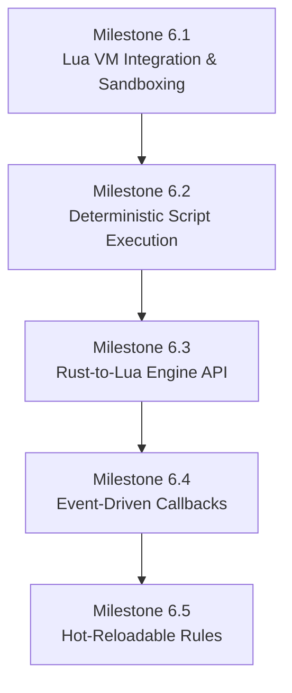

# Implementation Spec — Phase 6: Embedded Scripting & Game Logic (Lua Engine)

> **Status:** Ready to Implement  
> **Roadmap Phase:** Phase 6 — Embedded Scripting & Game Logic (Lua Engine)  
> **Reference ADRs:** [ADR-0006](../adr/en/0006-two-thread-network-gameloop-separation.md) · [ADR-0007](../adr/en/0007-deterministic-simulation-and-fixed-point.md) · [ADR-0010](../adr/en/0010-event-sourced-replay-format.md)

---

## 1. Context & Technical Motivation

In **Phases 1–5**, `loci2d` established a robust, highly deterministic simulation environment built on an authoritative game loop, event-sourced replay storage, and fixed-point 2D physics. However, game rules, character behaviors, and win/loss conditions currently reside entirely within compiled Rust code.

To enable rapid prototyping, modding, and content creation without recompiling the server, we need to embed a scripting language. **Lua** (via the `mlua` crate) is the industry standard for game scripting due to its lightweight VM, C-FFI compatibility, and fast execution.

### Core Goals of Phase 6
1. **Sandboxing**: Prevent malicious or buggy scripts from accessing the host file system, network, or OS functions.
2. **Strict Determinism**: Lua execution must conform to the rules set in **ADR-0007**. Non-deterministic features (like random iteration or system time) must be stripped or polyfilled to guarantee replay parity.
3. **Data-Oriented Interop**: Bridge Rust's `DeterministicVector2` and `I16F16` math safely into Lua, avoiding FPU conversions where possible.
4. **Event-Driven Lifecycle**: Trigger specific scripts upon connection, disconnection, collisions, and on every tick.
5. **Hot-Reloading**: Game designers must be able to tweak variables, hitboxes, and logic live while the server is running without disconnecting clients.

---

## 2. Architecture & 5 Sequential Milestones

As requested in the roadmap, this phase is broken into 5 sequential milestones.



### Milestone 6.1: Lua VM Integration (`mlua`) & Sandboxing

The Lua VM is instantiated on a per-`Instance` basis. To prevent security risks, we disable potentially dangerous standard libraries.

#### 1. Lua Environment Initialization
```rust
use mlua::prelude::*;

pub struct ScriptEngine {
    lua: Lua,
}

impl ScriptEngine {
    pub fn new() -> LuaResult<Self> {
        // Load only safe standard libraries. EXCLUDE `io`, `os`, `package`, and `debug`.
        let std_libs = mlua::StdLib::TABLE | mlua::StdLib::STRING | mlua::StdLib::MATH;
        let lua = Lua::new_with(std_libs, mlua::LuaOptions::default())?;
        
        Ok(Self { lua })
    }
}
```

> [!CAUTION]
> **Sandboxing Requirements:** Never expose the `io` or `os` libraries. The script must only interact with the world state through the explicitly provided Rust API.

---

### Milestone 6.2: Deterministic Script Execution

To satisfy [ADR-0007](../adr/en/0007-deterministic-simulation-and-fixed-point.md), Lua's non-deterministic elements must be removed or strictly controlled.

#### 1. Deterministic PRNG Polyfill
Lua's default `math.random` uses the host's C standard library `rand()`, which is inherently non-deterministic across platforms. We must inject a deterministic PRNG (e.g., PCG32 or a simple LCG seeded by the `Instance` seed).

```rust
// Overwrite `math.random` in the Lua globals table:
let math_table: LuaTable = lua.globals().get("math")?;
math_table.set("random", lua.create_function(|_, (min, max): (Option<i32>, Option<i32>)| {
    // Return values from our deterministic RNG instance, advancing the PRNG state.
    // ...
})?)?;
```

#### 2. Restricting `pairs()` Iteration
Lua's hash table iteration `pairs()` does not guarantee order. 
> [!WARNING]
> We must document and enforce that scripts use array-like tables (`ipairs()`) for entity iteration. When the Rust Engine API returns a list of entities to Lua, it must return them as a 1-indexed array (table), sorted by `entity_id` to preserve determinism.

---

### Milestone 6.3: Rust-to-Lua Engine API (Data-Oriented)

To avoid breaking determinism via 64-bit float (`f64`) conversions on the Lua side, `DeterministicVector2` operations are mapped strictly through `mlua::UserData` meta-methods. 

#### 1. Exposing Fixed-Point Vectors
```rust
impl mlua::UserData for DeterministicVector2 {
    fn add_methods<'lua, M: mlua::UserDataMethods<'lua, Self>>(methods: &mut M) {
        // We only expose components for debugging; math should be done via meta-methods
        methods.add_method("x_float", |_, vec, ()| Ok(vec.x.to_num::<f64>()));
        methods.add_method("y_float", |_, vec, ()| Ok(vec.y.to_num::<f64>()));
        
        // Expose arithmetic. Behind the scenes, everything stays in I16F16.
        methods.add_meta_method(mlua::MetaMethod::Add, |_, vec1, vec2: DeterministicVector2| {
            Ok(DeterministicVector2::new(vec1.x + vec2.x, vec1.y + vec2.y))
        });
        
        methods.add_meta_method(mlua::MetaMethod::Sub, |_, vec1, vec2: DeterministicVector2| {
            Ok(DeterministicVector2::new(vec1.x - vec2.x, vec1.y - vec2.y))
        });
    }
}
```

#### 2. Exposing the Entity API (ID-Based)
Rather than passing mutable references of the `Entity` struct to Lua, we provide an ID-based querying system. This respects Rust's borrowing rules and prevents Lua from holding stale entity references.

```lua
-- Example Lua API Usage
local player_id = ...
local pos = Loci.get_entity_position(player_id)
Loci.spawn_projectile(pos + Loci.Vector2(100, 0), { damage = 10 })
```

---

### Milestone 6.4: Event-Driven Gameplay Callbacks

The `Instance::tick()` loop will dispatch lifecycle events to the Lua VM.

#### 1. Calling Lua Hooks from Rust
```rust
impl ScriptEngine {
    pub fn on_tick(&self, current_tick: u64) -> LuaResult<()> {
        let globals = self.lua.globals();
        if let Ok(on_tick_fn) = globals.get::<_, LuaFunction>("on_tick") {
            on_tick_fn.call::<_, ()>(current_tick)?;
        }
        Ok(())
    }
    
    pub fn on_collision(&self, entity_a: u64, entity_b: u64) -> LuaResult<()> {
        let globals = self.lua.globals();
        if let Ok(on_col_fn) = globals.get::<_, LuaFunction>("on_collision") {
            on_col_fn.call::<_, ()>((entity_a, entity_b))?;
        }
        Ok(())
    }
}
```

#### 2. Required Lifecycle Hooks
* `on_init()`: Runs once when the instance starts or when a script is hot-reloaded.
* `on_tick(tick)`: Runs every tick, before physics integration.
* `on_player_join(entity_id)`: Dispatched when a client session successfully maps to an entity.
* `on_player_leave(entity_id)`: Dispatched on client timeout or disconnect.
* `on_collision(entity_a, entity_b)`: Dispatched when solid dynamic objects collide.
* `on_trigger_enter/stay/exit(entity, trigger_id)`: Dispatched based on Milestone 5.3 trigger states.

---

### Milestone 6.5: Hot-Reloadable Game Rules

Game scripts can be reloaded at runtime to reflect changes without disconnecting clients.

#### 1. File Watcher & Thread Synchronization
Because the `Instance::tick()` runs in an isolated Game Loop thread ([ADR-0006](../adr/en/0006-two-thread-network-gameloop-separation.md)), we cannot reload scripts arbitrarily.

1. A background thread uses the `notify` crate to watch the `scripts/` directory.
2. Upon file change, it sends a `ReloadScript` command over the `Receiver<Command>` channel to the Game Loop thread.
3. The Game Loop thread, **strictly between ticks**, drops the current Lua state and re-evaluates the script, calling `on_init()` again.

```rust
// In Instance::process_commands()
Command::ReloadScript(new_script_content) => {
    self.script_engine.reload(&new_script_content);
    self.script_engine.on_init();
}
```

---

## 3. Verification Plan & Test Matrix

| Test Suite | Focus Area | Verification Method |
|---|---|---|
| **Sandboxing Tests** (`tests/lua_sandbox_test.rs`) | IO & OS limits | Assert that attempting to open a file (`io.open`) or call `os.execute` yields a Lua error. |
| **Determinism Tests** (`tests/lua_determinism_test.rs`) | Polyfills & PRNG | Evaluate a script that calls `math.random` multiple times across two identical setups and assert identical output states. |
| **API Boundary Tests** (`tests/lua_api_test.rs`) | FFI & Math | Ensure Lua operations via meta-methods correctly maintain `I16F16` precision and prevent desyncs on edge cases. |
| **Hot-Reload Integration** | Thread Safety | Send a reload command mid-tick and ensure no race conditions occur or state corruption. |

---

## 4. Definition of Done Checklist

- [ ] **Milestone 6.1**: `mlua` dependency added; script environment loads with strict standard library exclusions.
- [ ] **Milestone 6.2**: `math.random` overridden with deterministic implementation tied to the instance seed.
- [ ] **Milestone 6.3**: `DeterministicVector2` and Entity ID-based query APIs exposed safely to Lua via `UserData`.
- [ ] **Milestone 6.4**: `on_tick`, `on_init`, `on_player_join`, `on_player_leave`, `on_collision`, and trigger callbacks implemented.
- [ ] **Milestone 6.5**: Script reloading supported via thread-safe command channel at deterministic tick boundaries.
