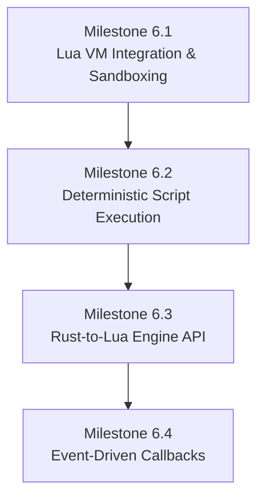

# Implementation Spec — Phase 6: Embedded Scripting & Game Logic (Lua Engine)

> **Status:** Ready to Implement  
> **Roadmap Phase:** Phase 6 — Embedded Scripting & Game Logic (Lua Engine)  
> **Reference ADRs:** [ADR-0006](../adr/en/0006-two-thread-network-gameloop-separation.md) · [ADR-0007](../adr/en/0007-deterministic-simulation-and-fixed-point.md) · [ADR-0010](../adr/en/0010-event-sourced-replay-format.md)

---

## 1. Context & Technical Motivation

In **Phases 1–5**, `loci2d` established a robust, highly deterministic simulation environment built on an authoritative game loop, event-sourced replay storage, and fixed-point 2D physics. However, game rules, character behaviors, and win/loss conditions currently reside entirely within compiled Rust code.

To enable rapid prototyping, modding, and content creation without recompiling the server, we need to embed a scripting language. **Lua** (via the `mlua` crate) is the industry standard for game scripting due to its lightweight VM, C-FFI compatibility, and fast execution.

### Core Goals of Phase 6
1. **Sandboxing**: Prevent malicious or buggy scripts from accessing the host file system, network, or OS functions.
2. **Strict Determinism**: Lua execution must conform to the rules set in **ADR-0007**. Non-deterministic features (like random iteration or system time) must be stripped or polyfilled to guarantee replay parity.
3. **Data-Oriented Interop**: Bridge Rust's `DeterministicVector2` and `I16F16` math safely into Lua, avoiding FPU conversions where possible.
4. **Event-Driven Lifecycle**: Trigger specific scripts upon connection, disconnection, collisions, and on every tick.
5. **[Deferred] Hot-Reloading**: Game designers must be able to tweak variables, hitboxes, and logic live while the server is running without disconnecting clients.

---
  
## 2. Architecture & 4 Sequential Milestones

As requested in the roadmap, this phase is broken into 4 sequential milestones.



### Milestone 6.1: Lua VM Integration (`mlua`) & Sandboxing

The Lua VM is instantiated on a per-`Instance` basis. To prevent security risks, we disable potentially dangerous standard libraries.

#### 1. Lua Environment Initialization
```rust
use mlua::prelude::*;

pub struct ScriptEngine {
    lua: Lua,
}

impl ScriptEngine {
    pub fn new() -> LuaResult<Self> {
        // Load only safe standard libraries. EXCLUDE `io`, `os`, `package`, and `debug`.
        let std_libs = mlua::StdLib::TABLE | mlua::StdLib::STRING | mlua::StdLib::MATH;
        let lua = Lua::new_with(std_libs, mlua::LuaOptions::default())?;
        
        Ok(Self { lua })
    }
}
```

> [!CAUTION]
> **Sandboxing Requirements:** 
> 1. Never expose the `io` or `os` libraries. The script must only interact with the world state through the explicitly provided Rust API.
> 2. **DoS Prevention:** We must set an instruction limit via `lua.set_hook` (or use `mlua`'s interrupt mechanisms) to yield or abort execution if a script enters an infinite loop (`while true do end`), protecting the authoritative game thread from freezing.

#### 2. Instance Integration & Script Loading
The `ScriptEngine` is owned directly by the `Instance` struct. Scripts are strictly loaded from local `.lua` files on the host file system (never over the network). When an `Instance` is initialized, it reads the entry-point script (e.g., `scripts/{map_name}/main.lua`) into a `String` and evaluates it.

```rust
pub struct Instance {
    // ... existing fields ...
    pub script_engine: ScriptEngine,
}

impl Instance {
    pub fn new(map_name: &str) -> Self {
        let mut script_engine = ScriptEngine::new().unwrap();
        let script_content = std::fs::read_to_string(format!("scripts/{}/main.lua", map_name))
            .expect("Failed to load map script");
            
        script_engine.lua.load(&script_content).exec().unwrap();
        
        // ... return Self
    }
}
```

---

### Milestone 6.2: Deterministic Script Execution

To satisfy [ADR-0007](../adr/en/0007-deterministic-simulation-and-fixed-point.md), Lua's non-deterministic elements must be removed or strictly controlled.

#### 1. Deterministic PRNG Polyfill
Lua's default `math.random` uses the host's C standard library `rand()`, which is inherently non-deterministic across platforms. We must inject a deterministic PRNG (e.g., PCG32 or a simple LCG seeded by the `Instance` seed).

```rust
// Overwrite `math.random` in the Lua globals table:
let math_table: LuaTable = lua.globals().get("math")?;
math_table.set("random", lua.create_function(|_, (min, max): (Option<i32>, Option<i32>)| {
    // Return values from our deterministic RNG instance, advancing the PRNG state.
    // ...
})?)?;
```

#### 2. Restricting `pairs()` Iteration
Lua's hash table iteration `pairs()` does not guarantee order. If a user iterates over their own custom tables using `pairs()`, the sequence will vary across machines, silently breaking replay parity.
> [!WARNING]
> We must aggressively prevent this by **removing `pairs()` from the Lua global environment** (`lua.globals().set("pairs", mlua::Value::Nil)`). Users must be forced to use `ipairs()` for arrays, or we must provide a custom deterministic (alphabetically sorted) iterator if they absolutely need to iterate over string-keyed tables.

#### 3. Script Hash Calculation
To satisfy ADR-0010's requirement for `.loci` replay playback, the `script_hash` is computed as the **SHA-256 digest of the exact string content** of the loaded script at `Instance` initialization. If the system later supports loading multiple files (e.g., via a sandboxed `require`), the hash must be computed from the concatenated strings of all loaded `.lua` files, ordered lexicographically by filename.

> [!IMPORTANT]
> **Replay Integration**: The `ReplayRecorder` must explicitly inject this hash into the `ReplayHeader`. During playback, the `ReplayPlayer`'s `--verify` mode **must** abort with an error if the local `main.lua` hash differs from the recorded `script_hash`, preventing silent desyncs.

---

### Milestone 6.3: Rust-to-Lua Engine API (Data-Oriented)

To avoid breaking determinism via 64-bit float (`f64`) conversions on the Lua side, `DeterministicVector2` operations are mapped strictly through `mlua::UserData` meta-methods. 

#### 1. Exposing Fixed-Point Vectors
```rust
impl mlua::UserData for DeterministicVector2 {
    fn add_methods<'lua, M: mlua::UserDataMethods<'lua, Self>>(methods: &mut M) {
        // We only expose components for debugging; math should be done via meta-methods
        methods.add_method("x_float", |_, vec, ()| Ok(vec.x.to_num::<f64>()));
        methods.add_method("y_float", |_, vec, ()| Ok(vec.y.to_num::<f64>()));
        
        // Expose arithmetic. Behind the scenes, everything stays in I16F16.
        methods.add_meta_method(mlua::MetaMethod::Add, |_, vec1, vec2: DeterministicVector2| {
            Ok(DeterministicVector2::new(vec1.x + vec2.x, vec1.y + vec2.y))
        });
        
        methods.add_meta_method(mlua::MetaMethod::Sub, |_, vec1, vec2: DeterministicVector2| {
            Ok(DeterministicVector2::new(vec1.x - vec2.x, vec1.y - vec2.y))
        });
    }
}
```

#### 2. Exposing the Entity API & Command Buffer
To bridge seamlessly into **Phase 6.5** (which requires strictly decoupling the canonical match state from Lua execution), Lua scripts **must not mutate the `Instance` directly mid-tick**. Instead, Lua writes to a **Command Buffer** that Rust processes at the end of the tick.

We provide an ID-based querying system for reading state, and a Command API for intending state changes:

```lua
-- Minimal main.lua Example Structure
function on_init()
    Loci.Log.info("Map Script Loaded!")
end

function on_tick(tick_number)
    -- Example Lua API Usage
    local player_id = Loci.get_entity_by_name("player_1")
    if player_id then
        local pos = Loci.get_entity_position(player_id)
        
        -- This does NOT spawn instantly. It pushes a Command to the Rust CommandBuffer.
        Loci.Commands.spawn_entity({ 
            blueprint = "box",
            position = pos + Loci.Vector2(100, 0)
        })
    end
end
```

### Milestone 6.4: Event-Driven Gameplay Callbacks

The `Instance::tick()` loop will dispatch lifecycle events to the Lua VM.

#### 1. Calling Lua Hooks from Rust
```rust
impl ScriptEngine {
    // Rust evaluates the Lua tick, then flushes and applies the Command Buffer
    pub fn on_tick(&self, current_tick: u64, command_buffer: &mut CommandBuffer) -> LuaResult<()> {
        let globals = self.lua.globals();
        if let Ok(on_tick_fn) = globals.get::<_, LuaFunction>("on_tick") {
            on_tick_fn.call::<_, ()>(current_tick)?;
        }
        
        // After Lua finishes, Rust safely applies all commands (spawns, damage, etc.)
        command_buffer.flush_and_apply();
        Ok(())
    }
    
    pub fn on_collision(&self, entity_a: u64, entity_b: u64, command_buffer: &mut CommandBuffer) -> LuaResult<()> {
        let globals = self.lua.globals();
        if let Ok(on_col_fn) = globals.get::<_, LuaFunction>("on_collision") {
            on_col_fn.call::<_, ()>((entity_a, entity_b))?;
        }
        Ok(())
    }
}
```

#### 2. Required Lifecycle Hooks
* `on_init()`: Runs once when the instance starts.
* `on_tick(tick)`: Runs every tick, before physics integration.
* `on_player_join(entity_id)`: Dispatched when a client session successfully maps to an entity.
* `on_player_leave(entity_id)`: Dispatched on client timeout or disconnect.
* `on_collision(entity_a, entity_b)`: Dispatched when solid dynamic objects collide.
* `on_trigger_enter/stay/exit(entity, trigger_id)`: Dispatched based on Milestone 5.3 trigger states.

#### 3. Error Handling Policy
If a Lua script throws an unhandled runtime error (e.g., syntax error, nil reference) during any callback (`on_tick`, `on_collision`, etc.), the error is structured-logged and the `Instance` **aborts immediately**. An authoritative server cannot trust corrupted game state. The room is shut down gracefully, and connected clients receive a `Disconnect` packet. It does *not* crash the main server binary, protecting other concurrent instances from being affected by one faulty script.

---

### Milestone 6.5: Hot-Reloadable Game Rules [DEFERRED]

> [!NOTE]
> **Deferred to Phase 9:** Hot-reloading scripts mid-match inherently breaks event-sourced deterministic replays unless an explicit script versioning system is built. To focus on core Lua API stability, hot-reloading and script versioning are deferred to Phase 9 (see Issue #8).

---

## 3. Verification Plan & Test Matrix

| Test Suite | Focus Area | Verification Method |
|---|---|---|
| **Sandboxing Tests** (`tests/lua_sandbox_test.rs`) | IO & OS limits | Assert that attempting to open a file (`io.open`) or call `os.execute` yields a Lua error. |
| **Determinism Tests** (`tests/lua_determinism_test.rs`) | Polyfills & PRNG | Evaluate a script that calls `math.random` multiple times across two identical setups and assert identical output states. |
| **API Boundary Tests** (`tests/lua_api_test.rs`) | FFI & Math | Ensure Lua operations via meta-methods correctly maintain `I16F16` precision and prevent desyncs on edge cases. |


---

## 4. Definition of Done Checklist

- [x] **Milestone 6.1**: `mlua` dependency added; script environment loads with strict standard library exclusions.
- [x] **Milestone 6.2**: `math.random` overridden with deterministic implementation tied to the instance seed.
- [x] **Milestone 6.3**: `DeterministicVector2` and Entity ID-based query APIs exposed safely to Lua via `UserData`.
- [x] **Milestone 6.4**: `on_tick`, `on_init`, `on_player_join`, `on_player_leave`, `on_collision`, and trigger callbacks implemented.
- [-] **Milestone 6.5**: [Deferred to Phase 9]
