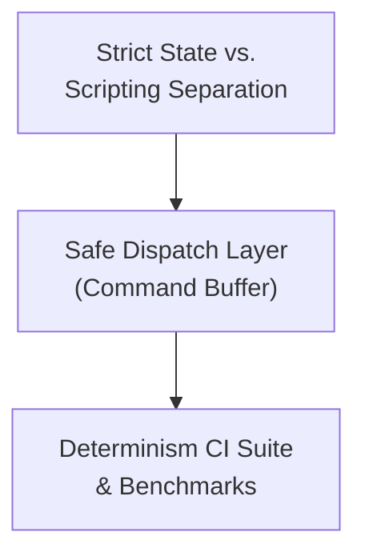

# Implementation Spec — Phase 6.5.1: Architecture, Safety & Determinism Validation

> **Status:** Ready to implement
> **Roadmap Phase:** Phase 6.5.1
> **Reference ADRs:** [ADR-0007](../adr/en/0007-deterministic-simulation-and-fixed-point.md) · [ADR-0014](../adr/en/0014-embedded-lua-scripting-and-command-buffer.md) · [ADR-0015](../adr/en/0015-dedicated-roadmap-structure-phase6.5-validation-dx.md)

---

## 1. Context & Current State

Phase 6.5.1 focuses on hardening the engine architecture by fully decoupling the canonical game state (deterministic physics, spatial data) from Lua script execution, and proving event-sourced replay integrity across different architectures.

| Component | Current state | Problem |
|---|---|---|
| `src/scripting/api.rs` | Lua API `spawn_entity` pushes command but returns nothing | Bad DX: Scripts cannot reference the newly spawned entity in the same tick |
| `src/scripting/command.rs` | `CommandBuffer` applies `SpawnEntity` and generates ID at flush time | Violates API ergonomics; ID must be known synchronously |
| `tests/` | Basic unit tests | Lacks tests that verify iterators aren't invalidated by Lua during collisions |
| `benches/benchmark.rs` | Standard loop benchmarking | Doesn't heavily stress Lua gameplay actions (spawns, collisions) for determinism |
| `CI (GitHub Actions)` | Non-existent or standard `cargo test` | Doesn't cross-validate `I16F16` hashing across `x86_64` and `ARM64` architectures |

---

## 2. Phase 6.5.1 Goal

Harden the architecture by fully decoupling Lua execution from canonical state iteration, ensuring a safe Command Buffer dispatch, and mathematically proving cross-platform determinism.



* **Immutable Access:** During a tick (e.g., in `on_tick` or `on_collision` callbacks), Lua scripts must not be able to invalidate Rust iterators over entities or physics components.
* **Safe Dispatch:** All state mutations requested by Lua must be deferred to the Command Buffer and applied strictly at the end of the tick.
* **Cross-Platform Proof:** The `I16F16` math must be proven to yield identical hashes on both x86_64 and ARM64 via CI.

---

## 3. Detailed Technical Design & Changes per File

### 3.1 `src/scripting/command.rs` — Update Command Enums

**Before:** `SpawnEntity` allocates the ID internally during `flush_and_apply`.
**After:** `SpawnEntity` receives the pre-allocated ID to apply.

```rust
pub enum Command {
    SpawnEntity { entity_id: u64, blueprint: String, position: DeterministicVector2 },
    DestroyEntity { entity_id: u64 },
    SetMoveSpeed { entity_id: u64, speed: I16F16 },
}
```

### 3.2 `src/scripting/api.rs` — Synchronous ID Allocation

Update the `spawn_entity` Lua binding to allocate the ID synchronously and return it to Lua.

* Require interior mutability for ID generation (e.g., passing a shared reference to the ID counter to the Lua scope, or allowing the `Instance` to generate IDs while immutably borrowed via `Cell<u64>`).
* Return the generated `u64` to Lua.

### 3.3 `tests/iterator_safety_test.rs` (New File)

Create a test simulating a Lua `on_collision` callback that attempts to destroy one of the colliding entities.
* Verify that the command is successfully deferred to the `CommandBuffer`.
* Verify that Rust does not panic due to modifying a collection while iterating.

### 3.4 `benches/benchmark.rs` & `tests/replay_determinism_test.rs`

Update the benchmarks to heavily stress Lua Gameplay Actions.
* Spam entity spawns, movement speed adjustments, and collisions.
* Ensure no desyncs occur under heavy load.

### 3.5 `.github/workflows/ci.yml` (New File)

Configure a GitHub Actions CI matrix.
* **Runners:** `ubuntu-latest` (x86_64) and `macos-latest` (or an ARM64 ubuntu runner if available).
* **Execution:** Run the `replay_determinism_test` and assert that the final world state SHA-256 hashes match exactly across both architectures.

---

## 4. Implementation Checklist

- [ ] **`src/scripting/command.rs`** — Update `Command::SpawnEntity` to contain `entity_id`.
- [ ] **`src/world/instance.rs`** — Refactor `next_entity_id` to use `Cell<u64>` (or similar) to allow synchronous ID allocation without a mutable instance borrow.
- [ ] **`src/scripting/api.rs`** — Update `Loci.Commands.spawn_entity` to return the pre-allocated ID synchronously.
- [ ] **`tests/iterator_safety_test.rs`** — Create test for decoupling validation (Lua attempting deletion during collision).
- [ ] **`benches/benchmark.rs`** — Add stress tests for Lua actions (spawns, speeds).
- [ ] **`.github/workflows/ci.yml`** — Create cross-platform determinism CI workflow matrix (`x86_64` and `ARM64`).

---

## 5. Phase 6.5.1 Completion Criteria

1. **Clean Build & Tests:** `cargo build` and `cargo test` pass with no errors or warnings.
2. **API Ergonomics:** `Loci.Commands.spawn_entity` returns an integer ID in Lua immediately upon calling, allowing scripts to use that ID in the same tick.
3. **Iterator Safety:** Attempting to destroy an entity from inside `on_collision` successfully defers the destruction and does not cause a Rust panic.
4. **Mathematical Determinism:** The GitHub Actions CI matrix passes on both `x86_64` and `ARM64` runners, outputting the exact same SHA-256 hash for a heavy integration test match replay.

---

## 6. Out of Scope for This Phase (Future Work)

| Feature | Phase |
|---|---|
| Client SDK wrappers (Godot/Love2D) | Phase 6.5.2 |
| Reference Examples & Templates | Phase 6.5.3 |
| Multi-instance / room manager | Phase 7 |
| Network security & anti-tamper | Phase 8 |
| Hot-reloading of Lua scripts | Phase 9 |
