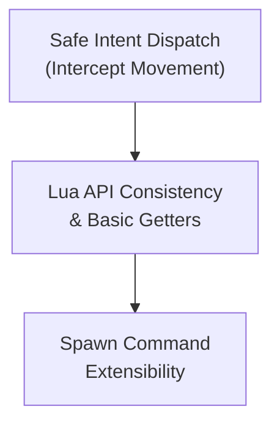

# Implementation Spec — Phase 6.5.2: API Refinement & SDK Preparation

> **Status:** Implemented
> **Roadmap Phase:** Phase 6.5.2
> **Reference ADRs:** [ADR-0014](../adr/en/0014-embedded-lua-scripting-and-command-buffer.md) · [ADR-0015](../adr/en/0015-dedicated-roadmap-structure-phase6.5-validation-dx.md) · [ADR-0016](../adr/en/0016-data-driven-entity-properties-and-engine-agnosticism.md)

---

## 1. Context & Current State

Phase 6.5.2 focuses on refining the Lua Engine API to remove inconsistencies, patch remaining holes in the safe dispatch model, and prepare the server layer for ergonomic consumption by future Client Wrappers and SDKs.

| Component | Current state | Problem |
|---|---|---|
| `src/world/intent_handler.rs` | `Intent::Move` and `Intent::MoveToPos` directly mutate Entity velocity and navigation | Bypasses Lua safety layer; scripts cannot intercept or deny movement (e.g., if stunned) |
| `src/scripting/api.rs` | Lacks getters (`get_velocity`, etc.); `Vector2` parameters are handled inconsistently | SDKs have to duplicate state; wrappers require boilerplate to translate data types |
| `src/scripting/command.rs` | `SpawnEntity` hardcodes `EntityType::Prop` and Default Navigation | Client SDKs lack full control over new entity initialization |

---

## 2. Phase 6.5.2 Goal

Refine the engine's Lua API to achieve total strictness in intent interception, ensure ergonomic consistency, and provide dynamic extensibility for blueprints.

* **Strict Interception:** No client intent should mutate the physics state directly. Every action must be authorized and validated by a Lua script hook.
* **Ergonomic Consistency:** Standardize `Vector2` passing and implement fundamental getters to prevent state duplication in Lua.
* **Blueprint Extensibility:** Empower `SpawnEntity` to assign dynamic properties and components on the fly without relying on Rust hardcodes.

---

## 3. Detailed Technical Design & Changes per File

### 3.1 `src/world/intent_handler.rs` — Movement Intent Interception

**Before:** `Intent::Move` directly overwrites `entity.velocity`.
**After:** `Intent::Move` delegates to the `ScriptEngine`.

* Remove direct mutations of `entity.velocity` and `entity.navigation.target`.
* Propagate intents by calling `instance.script_engine.on_move_intent(entity_id, dir_x, dir_y)` and `on_nav_intent(entity_id, target_x, target_y)`.
* Lua scripts are now fully responsible for invoking `Loci.Commands.set_velocity` if the movement is valid.

### 3.2 `src/scripting/engine.rs` — New Lifecycle Event Hooks

Add the necessary Lua VM bindings to support the new intents:
* Implement `on_move_intent(entity_id: u64, dir_x: f64, dir_y: f64)`.
* Implement `on_nav_intent(entity_id: u64, target_x: f64, target_y: f64)`.

### 3.3 `src/scripting/api.rs` — Consistent Types & Getters

Add fundamental read-only getters to the `Loci` table:
* `Loci.get_velocity(entity_id)` -> returns `(x, y)` floats.
* `Loci.get_move_speed(entity_id)` -> returns `speed` float.
* `Loci.get_entity_name(entity_id)` -> returns `String` *(Note: This is the inverse of `get_entity_by_name`, returning the string name for a given ID)*.

Unify `Vector2` setters:
* Refactor commands like `set_velocity` and `set_position` so that they can gracefully accept either a `Loci.Vector2` UserData object OR a table with `x` and `y` fields from Lua.

**Implementation Strategy:**
Use mlua's `Value` enum to detect argument type at runtime:
- If `UserData`: extract `DeterministicVector2` directly.
- If `Table`: extract `x` and `y` fields and construct `DeterministicVector2`.
- Otherwise: return a clear, descriptive error for Lua developers.

### 3.4 `src/scripting/command.rs` — Extensible Spawn

Refactor `Command::SpawnEntity` to accept a configuration payload instead of hardcoding types:
* Expand the command to accept an optional `config_table` (or serialized string of properties/components).
* Use the config to set the appropriate `EntityType`, configure `NavigationComponent`, and initialize properties dynamically upon spawning.

**Configuration Format:**
The `config_table` should support the following optional fields:
- `entity_type`: String ("Prop", "Player", "Enemy") - defaults to "Prop"
- `move_speed`: f64 - defaults to 1.0
- `radius`: f64 collider radius - defaults to 2.0
- `properties`: Table of key-value pairs to initialize entity properties

### 3.5 Unit Tests — Update Intent Validation

* **Audit existing tests:** Identify all integration tests that depend on direct movement (`Intent::Move` or `Intent::MoveToPos`) without Lua authorization.
* **Create standard Lua stub:** Develop a minimal script that authorizes movement for use across these tests.
* Rewrite tests in `src/world/instance.rs` (e.g., `test_explicit_move_to_pos_intent_and_preemption`) to load the Lua stub.
* **Verify hook extensibility:** Confirm that `engine.rs` supports adding `on_move_intent` and `on_nav_intent` without significant refactoring.

---

## 4. Implementation Checklist

- [ ] **`src/world/intent_handler.rs`** — Remove direct physics state mutation for `Move` and `MoveToPos`.
- [ ] **`src/scripting/engine.rs`** — Confirm extensibility and expose `on_move_intent` and `on_nav_intent` callbacks.
- [ ] **`src/scripting/api.rs`** — Implement `get_velocity`, `get_move_speed`, and `get_entity_name`.
- [ ] **`src/scripting/api.rs`** — Update `set_position`/`set_velocity` to accept `Table` or `Loci.Vector2` via `mlua::Value`.
- [ ] **`src/scripting/command.rs`** — Enhance `SpawnEntity` with dynamic configuration parameters.
- [ ] **`tests/` & `src/world/instance.rs`** — Audit existing tests, create Lua authorization stub, and update test dependencies.

---

## 5. Phase 6.5.2 Completion Criteria

1. **Movement is Authorized:** Client `Move` intents no longer bypass the Lua safe dispatch layer. A player cannot move unless the Lua script explicitly processes `on_move_intent` and invokes `set_velocity`.
2. **API Ergonomics:** Lua wrappers can effortlessly fetch velocity and move speed directly from the engine without maintaining duplicate local state tables.
3. **Spawn Flexibility:** `SpawnEntity` can successfully create entities with custom radiuses, speeds, and types defined entirely via the Lua script.
4. **Clean Tests:** All unit tests pass, successfully mocking the new Lua intermediate layer for movement.

---

## 6. Out of Scope for This Phase (Future Work)

| Feature | Phase |
|---|---|
| Client SDKs & Wrappers (Godot/Love2D) | Phase 6.5.3 |
| Reference Examples & Templates | Phase 6.5.4 |
| User-Friendly Documentation | Phase 6.5.5 |
| LAN Playtesting & Empirical Feedback | Phase 6.5.6 |
| Multi-instance / room manager | Phase 7 |
