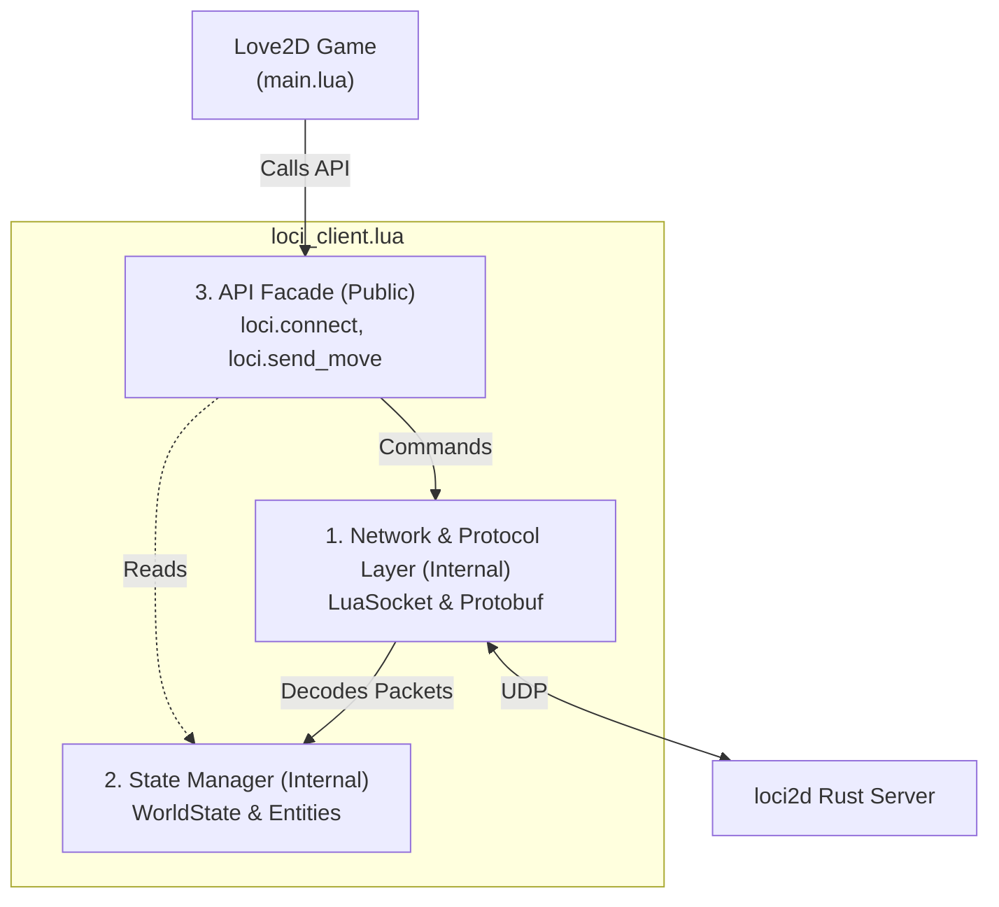

# Implementation Spec — Phase 6.5.3: Love2D SDK & MVP Client
> **Status:** Draft
> **Roadmap Phase:** Phase 6.5.3
> **Reference ADRs:** ADR-0018 (Client SDKs and Network Abstraction)

---

## 1. Context & Technical Motivation

To successfully build the 3v3 Arena MVP, the high school students will use **Love2D**. Because they lack knowledge of netcode, UDP sockets, and Protocol Buffers, we must provide an ergonomic, high-level SDK (`loci_client.lua`). 

The primary goal of this SDK is to **completely abstract the network layer**. The developers (students) should only interact with game state (Entities, Properties) and high-level intents (Move, Cast Ability), treating the multiplayer game almost as if it were a local single-player game.

---

## 2. ADR Compliance & Design Rationale

This phase specifically implements the directives of ADR-0018:

| ADR Decision | Implementation in this Spec |
|---|---|
| **Network Encapsulation** | `loci.update(dt)` hides the `luasocket` polling loop. Sequence IDs are incremented internally. |
| **State Management** | SDK maintains a local `entities` table that mirrors the `WorldState`. |
| **High-Level API Facade** | Client scripts only call `loci.send_move()` and never build `GamePacket` protobufs directly. |
| **Callbacks & Hooks** | SDK exposes `loci.on_property_changed` enabling reactive UI and FX without polling. |

---

## 3. Architecture Overview

The `loci_client.lua` module will be internally divided into three layers, but only the top layer is exposed to the developer:



---

## 4. Detailed Technical Design

### 4.1 Network & Protocol Layer (Internal)
* **Library:** Use `lua-protobuf` (pb) or `protoc` parser. For the student distribution, we will include the pre-compiled `pb.so`/`pb.dll` or a pure-Lua fallback.
* **LuaSocket:** `udp:settimeout(0)` will be used to ensure non-blocking reads during the Love2D `love.update(dt)` loop.
* **Envelope Wrapping:** All outward intents are wrapped in `GamePacket` > `ClientIntent` > `SpecificIntent` and serialized.

### 4.2 State Manager & Diffing Logic (Internal)
* **Entity Tracking:** A local table `loci.entities = {}` stores the current state.
* **Diffing Logic:** When a new `WorldState` packet arrives:
  1. Compare new entities against `loci.entities`.
  2. If an entity is new, trigger `loci.on_entity_spawned(entity)`.
  3. For existing entities, iterate over their `properties`. If a property value changed, trigger `loci.on_property_changed(entity, key, old_val, new_val)`.
  4. If an entity in `loci.entities` is missing from the new `WorldState`, trigger `loci.on_entity_despawned(entity_id)` and remove it.
* **Interpolation (Linear):** To smooth out 30Hz server ticks to 60Hz/144Hz client framerates, the SDK will linearly interpolate the entity's rendering coordinates based on `velocity` and `dt` between server ticks.

### 4.3 API Facade (Public)
*(High-level Lua functions the students will call)*

* `loci.connect(ip, port, player_name)`: Sends `JoinIntent`.
* `loci.disconnect(reason)`: Sends `DisconnectIntent`.
* `loci.update(dt)`: Main poll loop.
* `loci.get_entities()`, `loci.get_my_entity()`: State accessors.
* `loci.send_move(dir_x, dir_y)`, `loci.send_action(ability_id, aim_x, aim_y)`: Intent builders.
* Callbacks: `on_entity_spawned`, `on_entity_despawned`, `on_property_changed`, `on_match_state_changed`, `on_action_cast`.

### 4.4 Usage Example

A complete `main.lua` example showing how a student would use the SDK:

```lua
function love.load()
    -- Connect to the loci2d server
    loci.connect("127.0.0.1", 8080, "Player1")
    
    -- Set up callbacks for game events
    loci.on_entity_spawned = function(entity)
        print("New entity spawned:", entity.id)
        spawn_visual(entity)
    end
    
    loci.on_entity_despawned = function(entity_id)
        print("Entity despawned:", entity_id)
        remove_visual(entity_id)
    end
    
    loci.on_property_changed = function(entity, key, old_val, new_val)
        if key == "hp" then
            update_health_bar(entity, new_val)
        elseif key == "team" then
            update_team_color(entity, new_val)
        end
    end
    
    loci.on_action_cast = function(entity, ability_id, dir_x, dir_y)
        play_ability_animation(entity, ability_id)
    end
end

function love.update(dt)
    -- Process network packets and update state
    loci.update(dt)
    
    -- Send movement intents based on keyboard input
    local dx, dy = 0, 0
    if love.keyboard.isDown("w") then dy = -1 end
    if love.keyboard.isDown("s") then dy = 1 end
    if love.keyboard.isDown("a") then dx = -1 end
    if love.keyboard.isDown("d") then dx = 1 end
    
    if dx ~= 0 or dy ~= 0 then
        loci.send_move(dx, dy)
    end
end

function love.mousepressed(x, y, button)
    if button == 1 then
        local my_entity = loci.get_my_entity()
        if my_entity then
            -- Cast basic attack (ability_id = 1) toward mouse position
            loci.send_action(1, x, y)
        end
    elseif button == 2 then
        -- Cast ultimate (ability_id = 2)
        local my_entity = loci.get_my_entity()
        if my_entity then
            loci.send_action(2, x, y)
        end
    end
end

function love.draw()
    -- Render all entities from the authoritative world state
    for _, entity in ipairs(loci.get_entities()) do
        draw_entity_sprite(entity)
        draw_entity_name(entity)
    end
    
    -- Center camera on local player
    local my_entity = loci.get_my_entity()
    if my_entity then
        center_camera(my_entity.x, my_entity.y)
    end
end

function love.quit()
    loci.disconnect("Player quit")
end
```

---

## 5. Verification Plan & Test Matrix

We will manually and automatically verify the SDK functionality using a controlled test environment.

| Test Case | Method | Expected Result |
|---|---|---|
| **T1: Handshake** | Call `loci.connect` and `loci.disconnect` | Server logs Join and Disconnect; client gracefully cleans up. |
| **T2: Movement Intent** | Call `loci.send_move(1, 0)` | Server receives `MoveIntent`, authorizes via Lua script, updates velocity. |
| **T3: State Replication** | Server spawns NPC | Client receives `WorldState`, triggers `on_entity_spawned`. |
| **T4: Property Diffing** | Server changes NPC `hp` from 100 to 50 | Client triggers `on_property_changed(npc, "hp", "100", "50")`. |

---

## 6. Implementation Checklist

- [ ] **1. Protobuf Integration**
  - [ ] Add `lua-protobuf` binaries/scripts to `sdks/love2d/lib/`.
  - [ ] Compile `game_packets.proto` to `game_packets.pb` for distribution.
- [ ] **2. Network Scaffold (`sdks/love2d/loci_client.lua`)**
  - [ ] Implement UDP socket initialization in `loci.connect`.
  - [ ] Implement non-blocking `receive()` loop in `loci.update`.
  - [ ] Implement `loci.disconnect` to send `DisconnectIntent`.
- [ ] **3. State Manager**
  - [ ] Implement `WorldState` parsing loop.
  - [ ] Implement property diffing and callback dispatch (`on_property_changed`).
  - [ ] Implement client-side linear interpolation using `dt` and `velocity`.
- [ ] **4. Intent Builders**
  - [ ] Implement `loci.send_move` wrapping `MoveIntent`.
  - [ ] Implement `loci.send_action` wrapping `ActionIntent`.
- [ ] **5. Example Refactor**
  - [ ] Rewrite `examples/love2d/main.lua` to remove all raw luasocket/protobuf code, relying entirely on `loci_client.lua`.

---

## 7. Out of Scope for This Phase

* **Advanced Interpolation/Prediction:** Client-side prediction (rollback, reconciling) is strictly out of scope. The client is a "dumb terminal" with basic linear interpolation between ticks.
* **Hot-Reloading:** Hot-reloading the Lua SDK code during runtime is not required for this phase.
* **TCP Fallback:** The engine remains strictly UDP.
* **Other Engines (Godot, Python):** Phase 6.5.3 focuses exclusively on the Love2D SDK.

---

## 8. Phase 6.5.3 Completion Criteria

1. **Ergonomic API:** The `examples/love2d/main.lua` file no longer contains any `luasocket` or `protobuf` code directly.
2. **Stable Connection Lifecycle:** The client can successfully join, stream the world state, and gracefully disconnect without crashing.
3. **Property Callbacks:** Changing an entity's property on the server reliably triggers `loci.on_property_changed` on the client.
4. **Intent Dispatch:** The client can send `MoveIntent` and `ActionIntent` which are successfully received and authorized by the server's Lua script engine.
