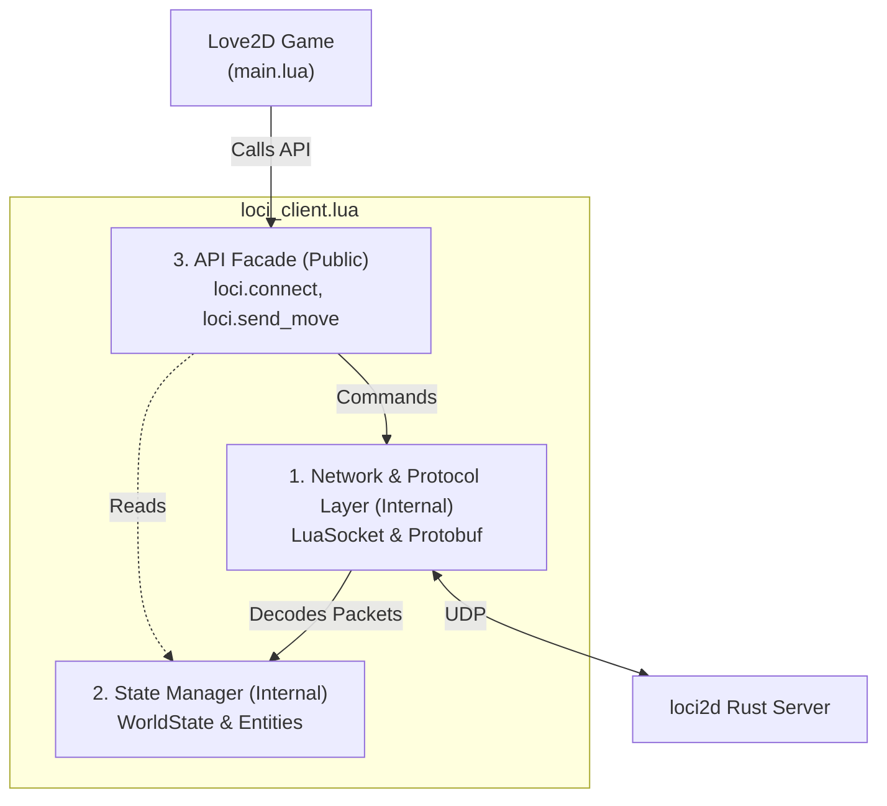

# Implementation Spec — Phase 6.5.3: Love2D SDK & MVP Client
> **Status:** Ready to Implement
> **Roadmap Phase:** Phase 6.5.3
> **Reference ADRs:** ADR-0018 (Client SDKs and Network Abstraction) · ADR-0019 (Authoritative Intent Rejection Feedback) · ADR-0008 (Session Lifecycle) · ADR-0007 (Fixed-Point Arithmetic)

---

## 1. Context & Technical Motivation

To successfully build the 3v3 Arena MVP, the high school students will use **Love2D**. Because they lack knowledge of netcode, UDP sockets, and Protocol Buffers, we must provide an ergonomic, high-level SDK (`loci_client.lua`). 

The primary goal of this SDK is to **completely abstract the network layer**. The developers (students) should only interact with game state (Entities, Properties) and high-level intents (Move, Cast Ability), treating the multiplayer game almost as if it were a local single-player game.

---

## 2. ADR Compliance & Design Rationale

This phase implements the directives of ADR-0018 and is constrained by the following additional ADRs:

| ADR | Decision | Implementation in this Spec |
|---|---|---|
| **ADR-0018** | **Network Encapsulation** | `loci.update(dt)` hides the `luasocket` polling loop. Sequence IDs are incremented internally. |
| **ADR-0018** | **State Management** | SDK maintains a local `entities` table that mirrors the `WorldState`. |
| **ADR-0018** | **High-Level API Facade** | Client scripts only call `loci.send_move()` and never build `GamePacket` protobufs directly. |
| **ADR-0018** | **Callbacks & Hooks** | SDK exposes `loci.on_property_changed` enabling reactive UI and FX without polling. |
| **ADR-0018** | **Intent Feedback** | SDK intercepts `ServerResponse` packets to fire `loci.on_intent_rejected`, avoiding silent failures for the user. |
| **ADR-0008** | **Session Lifecycle** | `loci.update(dt)` sends a periodic `PingIntent` heartbeat (every ~2s) to prevent server-side timeout (`CLIENT_TIMEOUT_SECS = 10s`). |
| **ADR-0007** | **Fixed-Point Arithmetic** | The server transmits all `Vector2` fields as I16F16 fixed-point (`int32 x_bits`, `int32 y_bits`). The SDK converts them to Lua floats internally (`x = x_bits / 65536.0`) so developers only ever see plain `.x` and `.y` float fields. |

---

## 3. Architecture Overview

The `loci_client.lua` module will be internally divided into three layers, but only the top layer is exposed to the developer:



---

## 4. Detailed Technical Design

### 4.1 Network & Protocol Layer (Internal)
* **Library:** Use `lua-protobuf` (pb) or `protoc` parser. For the student distribution, we will include the pre-compiled `pb.so`/`pb.dll` or a pure-Lua fallback.
* **LuaSocket:** `udp:settimeout(0)` will be used to ensure non-blocking reads during the Love2D `love.update(dt)` loop.
* **Outbound Envelope:** All outward intents are wrapped in `GamePacket` > `ClientIntent` > `SpecificIntent` and serialized via `pb.encode("loci2d.GamePacket", packet)`.
* **Inbound Envelope:** The server sends `loci2d.ServerPacket` (a `oneof` of `WorldState` or `ServerResponse`). The network layer must decode `loci2d.ServerPacket` first, then dispatch based on the `payload` field. **Never decode `loci2d.WorldState` directly from the raw UDP bytes.**
* **Fixed-Point Conversion (ADR-0007):** All `Vector2` proto fields use I16F16 fixed-point integers (`x_bits`, `y_bits`). The Network layer converts them to Lua floats on ingestion: `x = x_bits / 65536.0`. Outbound vectors (e.g. `MoveIntent.direction`) are encoded as `x_bits = math.floor(val * 65536)`. This conversion is strictly internal — no other layer deals with `x_bits`/`y_bits`.

### 4.2 State Manager & Diffing Logic (Internal)
* **Entity Tracking:** A local table `loci.entities = {}` stores the current state.
* **Globals Tracking:** A local table `loci.globals = {}` stores the `WorldState.globals` repeated Property list (e.g. match timer, team scores). Exposed via `loci.get_globals()`.
* **Diffing Logic:** When a new `WorldState` packet arrives:
  1. Compare new entities against `loci.entities`.
  2. If an entity is new, trigger `loci.on_entity_spawned(entity)`.
  3. For existing entities, iterate over their `properties`. If a property value changed, trigger `loci.on_property_changed(entity, key, old_val, new_val)`.
  4. If an entity in `loci.entities` is missing from the new `WorldState`, trigger `loci.on_entity_despawned(entity_id)` and remove it.
  5. Update `loci.globals` from `WorldState.globals` on every tick.
* **Interpolation (Linear):** To smooth out 30Hz server ticks to 60Hz/144Hz client framerates, the SDK will linearly interpolate the entity's rendering coordinates based on `velocity` and `dt` between server ticks.
* **Response Handling:** When a `ServerResponse` packet arrives indicating a rejected intent, the SDK triggers `loci.on_intent_rejected(reason)` to provide explicit feedback to the developer. **Edge case:** if an entity's `velocity` is `(0, 0)`, interpolation is skipped and the authoritative `position` from the last tick is used directly, preventing phantom drift.

### 4.3 API Facade (Public)
*(High-level Lua functions the students will call)*

* `loci.connect(ip, port, player_name)`: Initializes the UDP socket, sends `JoinIntent`, and records `my_entity_id` from the first `WorldState` that includes the player's entity.
* `loci.disconnect(reason)`: Sends `DisconnectIntent` and closes the socket.
* `loci.update(dt)`: Main poll loop — drains incoming UDP packets, runs the diffing logic, advances interpolation, and sends a `PingIntent` heartbeat every 2 seconds to prevent server-side session timeout (ADR-0008).
* `loci.get_entities()`: Returns the current `loci.entities` table (array of entity objects with plain float `.x`, `.y` fields).
* `loci.get_my_entity()`: Returns the entity object for the local player, or `nil` if not yet joined.
* `loci.get_globals()`: Returns the current `loci.globals` table (key-value map of match-wide properties, e.g. `"match_timer"`, `"score_red"`).
* `loci.send_move(dir_x, dir_y)`: Encodes a `MoveIntent` with the given direction floats (SDK converts to fixed-point internally).
* `loci.send_action(ability_id, aim_x, aim_y)`: Encodes an `ActionIntent`. **`aim_x, aim_y` are world-space coordinates (e.g. mouse position converted to world space).** The SDK computes the normalized direction vector relative to the local player's current position before encoding as fixed-point. If `get_my_entity()` is `nil`, the call is a no-op.
* Callbacks: `on_entity_spawned(entity)`, `on_entity_despawned(entity_id)`, `on_property_changed(entity, key, old_val, new_val)`, `on_match_state_changed(state)`, `on_action_cast(entity, ability_id, dir_x, dir_y)`, `on_intent_rejected(reason)`.

### 4.4 Usage Example

A complete `main.lua` example showing how a student would use the SDK:

```lua
function love.load()
    -- Connect to the loci2d server
    loci.connect("127.0.0.1", 8080, "Player1")
    
    -- Set up callbacks for game events
    loci.on_entity_spawned = function(entity)
        print("New entity spawned:", entity.id)
        spawn_visual(entity)
    end
    
    loci.on_entity_despawned = function(entity_id)
        print("Entity despawned:", entity_id)
        remove_visual(entity_id)
    end
    
    loci.on_property_changed = function(entity, key, old_val, new_val)
        if key == "hp" then
            update_health_bar(entity, new_val)
        elseif key == "team" then
            update_team_color(entity, new_val)
        end
    end
    
    loci.on_action_cast = function(entity, ability_id, dir_x, dir_y)
        play_ability_animation(entity, ability_id)
    end
    
    loci.on_intent_rejected = function(reason)
        print("Server rejected our action:", reason)
        show_floating_text("Action Failed: " .. reason)
    end
end

function love.update(dt)
    -- Process network packets and update state
    loci.update(dt)
    
    -- Send movement intents based on keyboard input
    local dx, dy = 0, 0
    if love.keyboard.isDown("w") then dy = -1 end
    if love.keyboard.isDown("s") then dy = 1 end
    if love.keyboard.isDown("a") then dx = -1 end
    if love.keyboard.isDown("d") then dx = 1 end
    
    if dx ~= 0 or dy ~= 0 then
        loci.send_move(dx, dy)
    end
end

function love.mousepressed(x, y, button)
    -- x, y are Love2D screen coordinates.
    -- Convert to world-space coordinates before passing to loci.send_action.
    -- The SDK will compute the normalized direction vector relative to the
    -- local player's position internally (ActionIntent.target_direction is
    -- a normalized vector, not an absolute position — see game_packets.proto).
    local world_x = x - love.graphics.getWidth() / 2
    local world_y = y - love.graphics.getHeight() / 2

    if button == 1 then
        -- Cast basic attack (ability_id = 1) toward mouse world position
        loci.send_action(1, world_x, world_y)
    elseif button == 2 then
        -- Cast ultimate (ability_id = 2) toward mouse world position
        loci.send_action(2, world_x, world_y)
    end
end

function love.draw()
    -- Render all entities from the authoritative world state
    for _, entity in ipairs(loci.get_entities()) do
        draw_entity_sprite(entity)
        draw_entity_name(entity)
    end
    
    -- Center camera on local player
    local my_entity = loci.get_my_entity()
    if my_entity then
        center_camera(my_entity.x, my_entity.y)
    end
end

function love.quit()
    loci.disconnect("Player quit")
end
```

---

## 5. Verification Plan & Test Matrix

We will manually and automatically verify the SDK functionality using a controlled test environment.

| Test Case | Method | Expected Result |
|---|---|---|
| **T1: Handshake** | Call `loci.connect` and `loci.disconnect` | Server logs Join and Disconnect; client gracefully cleans up. |
| **T2: Movement Intent** | Call `loci.send_move(1, 0)` | Server receives `MoveIntent`, authorizes via Lua script, updates velocity. |
| **T3: State Replication** | Server spawns NPC | Client receives `WorldState`, triggers `on_entity_spawned`. |
| **T4: Property Diffing** | Server changes NPC `hp` from 100 to 50 | Client triggers `on_property_changed(npc, "hp", "100", "50")`. |
| **T5: Intent Rejection** | Server rejects movement (e.g. stunned) and returns `ServerResponse` | Client triggers `on_intent_rejected(reason)`. |

---

## 6. Implementation Checklist

- [x] **1. Protobuf Integration**
  - [x] Add `lua-protobuf` binaries/scripts to `sdks/love2d/lib/`.
  - [x] Compile `game_packets.proto` to `game_packets.pb` for distribution.
- [x] **2. Network Scaffold (`sdks/love2d/loci_client.lua`)**
  - [x] Implement UDP socket initialization in `loci.connect`.
  - [x] Implement non-blocking `receive()` loop in `loci.update`, decoding `loci2d.ServerPacket` as the inbound envelope.
  - [x] Implement fixed-point conversion helpers: `bits_to_float(bits)` and `float_to_bits(f)` using `/ 65536.0` and `math.floor(f * 65536)` respectively.
  - [x] Implement periodic `PingIntent` heartbeat inside `loci.update` (every 2s) to maintain session (ADR-0008).
  - [x] Implement `loci.disconnect` to send `DisconnectIntent`.
- [x] **3. State Manager & Feedback**
  - [x] Implement `ServerPacket` dispatch: route `world_state` vs `response` payloads.
  - [x] Implement `WorldState` entity diffing loop with `on_entity_spawned`, `on_property_changed`, and `on_entity_despawned` callbacks.
  - [x] Implement `ServerResponse` handling to dispatch `on_intent_rejected`.
  - [x] Implement `loci.globals` update from `WorldState.globals` on every tick; expose via `loci.get_globals()`.
  - [x] Implement client-side linear interpolation using `dt` and `velocity`; skip interpolation when `velocity == (0, 0)`.
- [x] **4. Intent Builders**
  - [x] Implement `loci.send_move` wrapping `MoveIntent` (floats → fixed-point).
  - [x] Implement `loci.send_action` wrapping `ActionIntent`: compute normalized direction vector from `(aim_x, aim_y)` relative to `get_my_entity()` position; encode as fixed-point.
- [x] **5. Example Refactor**
  - [x] Rewrite `examples/love2d/main.lua` to remove all raw luasocket/protobuf code, relying entirely on `loci_client.lua`.
  - [x] Spectator mode and replay toggle are **out of scope** for this refactor (see Section 7). The new example is a pure player-mode client.

---

## 7. Out of Scope for This Phase

* **Advanced Interpolation/Prediction:** Client-side prediction (rollback, reconciling) is strictly out of scope. The client is a "dumb terminal" with basic linear interpolation between ticks.
* **Hot-Reloading:** Hot-reloading the Lua SDK code during runtime is not required for this phase.
* **TCP Fallback:** The engine remains strictly UDP.
* **Other Engines (Godot, Python):** Phase 6.5.3 focuses exclusively on the Love2D SDK.
* **Spectator / Replay Mode:** The current `examples/love2d/main.lua` has a spectator toggle. This feature is explicitly **not** ported to the new `loci_client.lua` SDK in this phase. The refactored example will be player-only. A `loci.connect_spectator()` API is deferred to Phase 6.5.4.

---

## 8. Phase 6.5.3 Completion Criteria

1. **Ergonomic API:** The `examples/love2d/main.lua` file no longer contains any `luasocket` or `protobuf` code directly.
2. **Stable Connection Lifecycle:** The client can successfully join, stream the world state, and gracefully disconnect without crashing.
3. **Property Callbacks:** Changing an entity's property on the server reliably triggers `loci.on_property_changed` on the client.
4. **Intent Dispatch & Feedback:** The client can send `MoveIntent` and `ActionIntent`. If the server rejects them, the client reliably receives a `ServerResponse` and fires `on_intent_rejected`.
